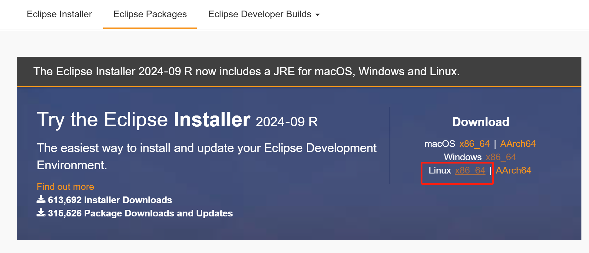
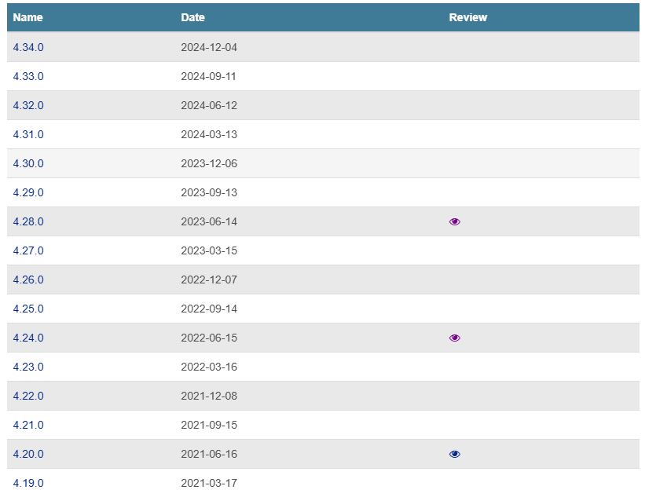
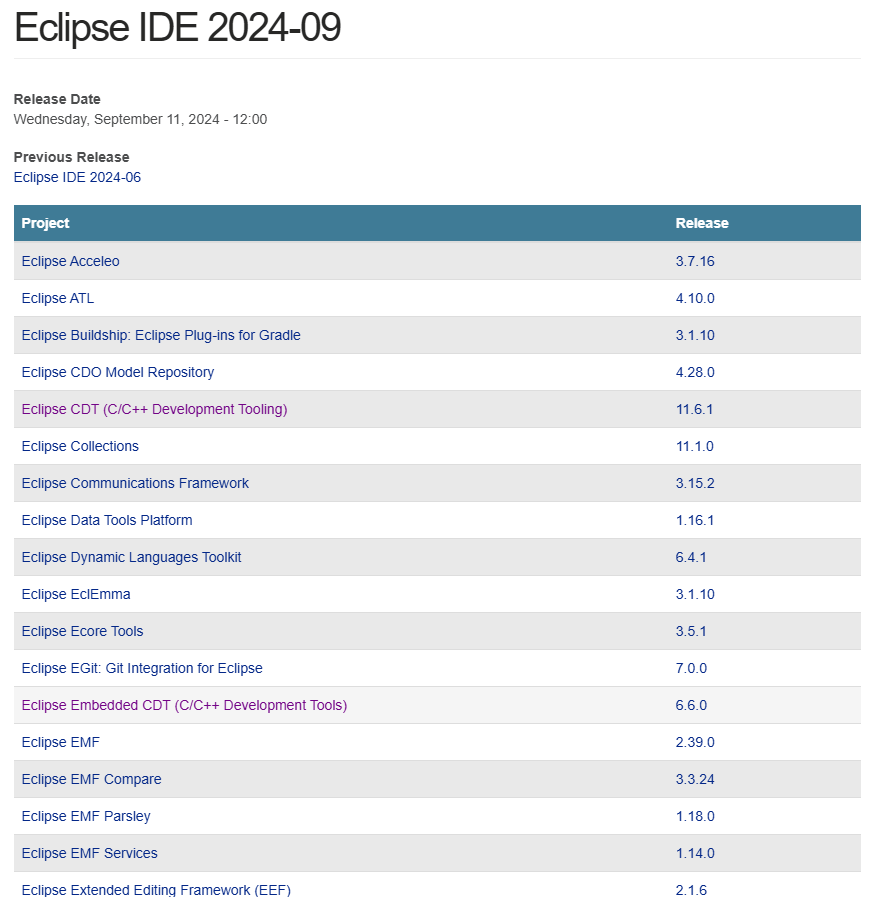
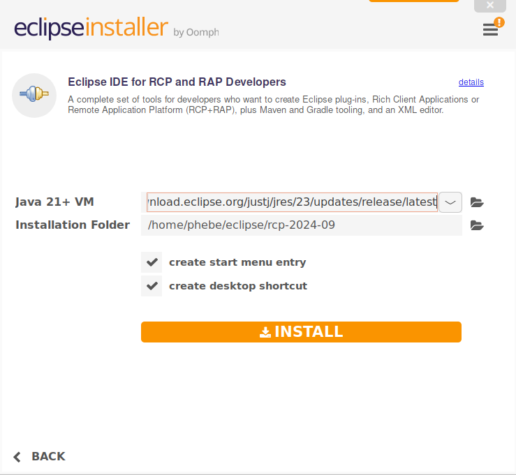
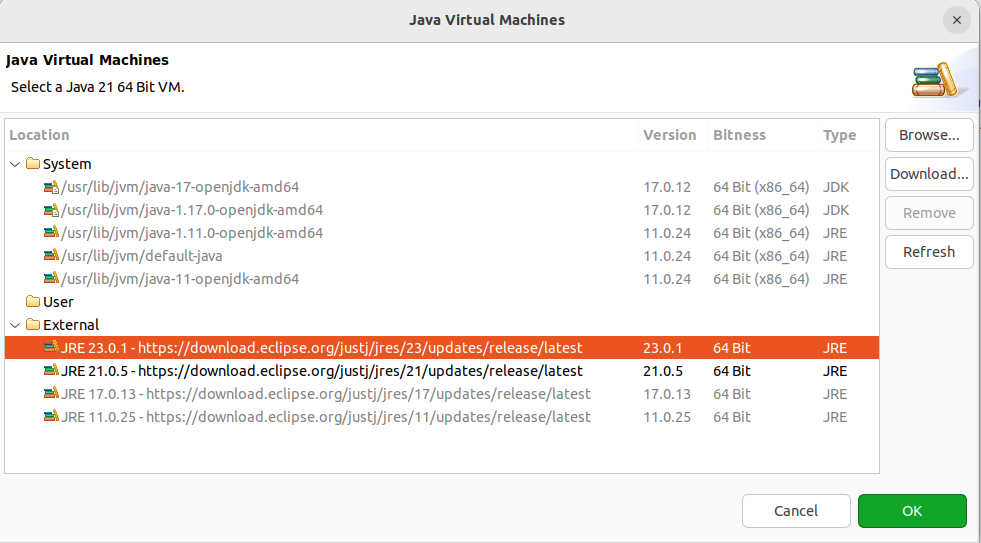
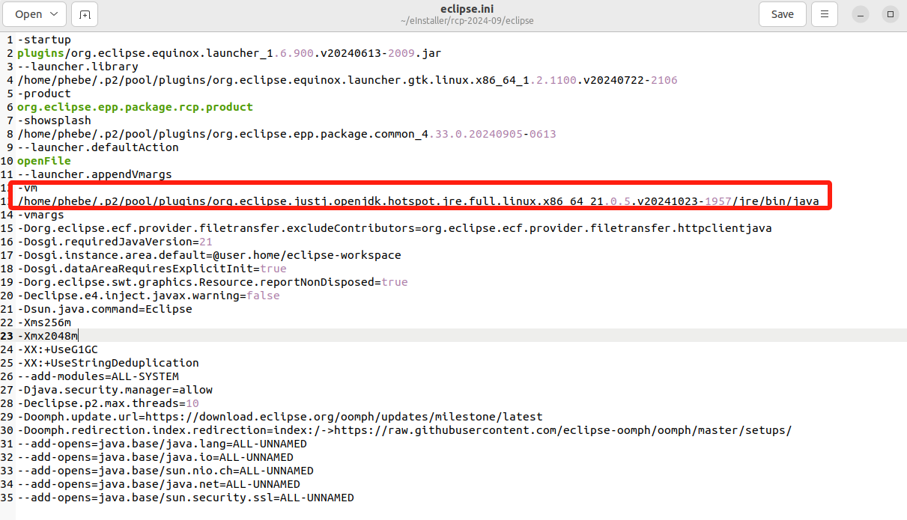
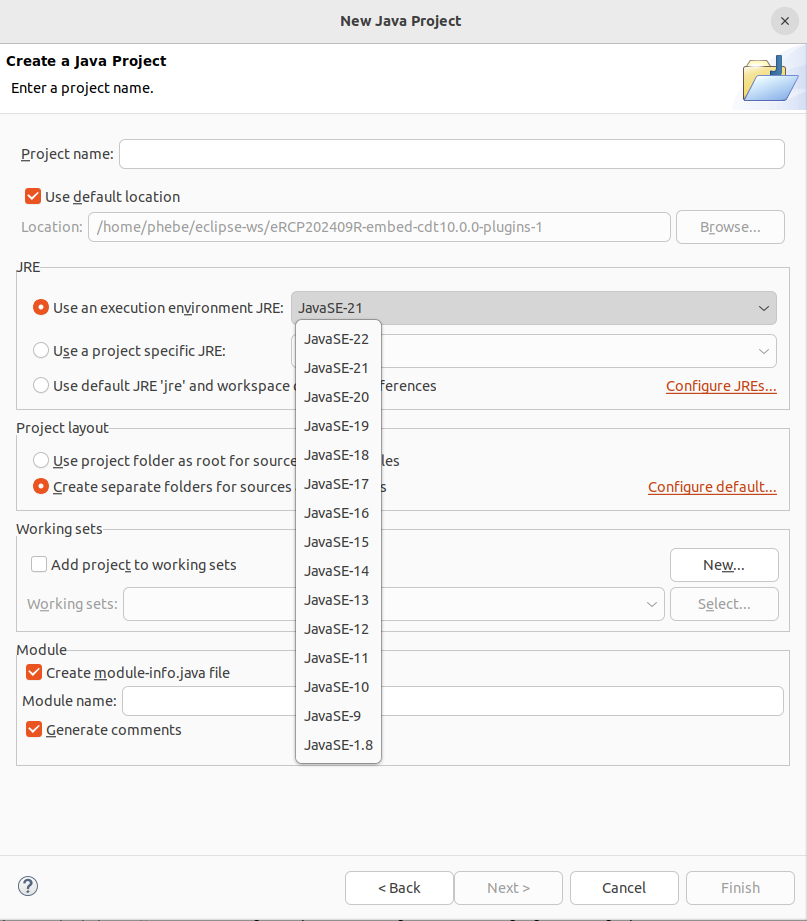

## Eclipse IDE 概述

### Eclipse 简介：开源、许可证

* Eclipse官网：https://www.eclipse.org/

  * 简介：https://eclipse.dev/eclipse/
  * Eclipse IDE ：https://eclipseide.org/
  * Project：https://projects.eclipse.org/projects/technology.packaging
  * 下载：https://www.eclipse.org/downloads/
  * 每日构建：https://download.eclipse.org/eclipse/downloads/
  * 文档与帮助：
    * Getting started：https://eclipseide.org/getting-started/
    * Help：https://help.eclipse.org/2024-09/index.jsp
* 法律相关：官网最下方 Legal 板块，包含了[隐私策略](https://www.eclipse.org/legal/privacy/)、[使用条款](https://www.eclipse.org/legal/terms-of-use/)、[合规](https://www.eclipse.org/legal/compliance/)、[行为准则](https://www.eclipse.org/org/documents/Community_Code_of_Conduct.php)、[法律资源](https://www.eclipse.org/legal/)、[管理 Cookie](https://www.eclipse.org/#) 等相关的信息。
* 开源特性与许可证：可否二次开发、二次分发、产品化

  * github仓库：

    * [eclipse](https://github.com/eclipse)：https://github.com/eclipse   [EPL-2.0 license](https://github.com/eclipse-cdt/cdt#)

      * > 这是Eclipse基金会的主要组织，一个综合性的入口，包含多个Eclipse项目的代码库。它涵盖了广泛的项目，包括Eclipse IDE、Jakarta EE等各种开源项目。
        >
    * [eclipse-platform](https://github.com/eclipse-platform)：https://github.com/eclipse-platform

      * > 专门针对Eclipse平台的组织，主要集中在Eclipse IDE的核心框架和相关工具上。该组织的项目主要涉及构建和扩展Eclipse IDE的功能，包括用户界面、调试基础设施以及其他基础服务。
        >
    * [eclipse-cdt](https://github.com/eclipse-cdt)：https://github.com/eclipse-cdt/cdt   [EPL-2.0 license](https://github.com/eclipse-cdt/cdt#)
    * [eclipse-embed-cdt](https://github.com/eclipse-embed-cdt)：https://github.com/eclipse-embed-cdt/eclipse-plugins  [EPL-2.0 license](https://github.com/eclipse-embed-cdt/eclipse-plugins?tab=EPL-2.0-1-ov-file#)
    * [eclipse-packaging](https://github.com/eclipse-packaging)：https://github.com/eclipse-packaging/packages   [EPL-2.0 license](https://github.com/eclipse-packaging/packages#)

  - 除非项目文档中另有说明，否则 **[Eclipse 公共许可证](https://www.eclipse.org/legal/epl-2.0)** （EPL） 是 Eclipse Foundation 项目的默认许可证（请参阅 [Eclipse 公共许可证常见问题](https://www.eclipse.org/org/documents/epl-2.0/faq.php)）;目前基于Eclipse CDT和Embedded CDT进行二次开发和产品化是可行的。

    > - a)根据本协议的条款，每个贡献者在此授予接收方非独家的，全球的，免版税的版权许可，以复制，准备衍生作品，公开展示，公开表演，分发和再许可该贡献者的贡献，如果有的话，以及该衍生作品。
    > - b)根据本协议的条款，每个贡献者在此授予接收方一项非排他性的、全球范围的、免版税的专利许可，允许其以源代码或其他形式制作、使用、销售、提供销售、进口和以其他方式转让该贡献者的贡献。如果在贡献者添加贡献时，该贡献的添加导致该组合被许可专利覆盖，则本专利许可应适用于贡献和程序的组合。专利许可不适用于包含该贡献的任何其他组合。本协议不许可硬件本身。
    >
  - [ Third Party Content Licenses](https://www.eclipse.org/legal/licenses) 提供了已批准用于 Eclipse 项目使用的第三方内容的许可证列表;

  #### 总结：

  大致情况：


  - Eclipse CDT 和 Embedded CDT 都遵循 Eclipse公共许可证（Eclipse Public License, EPL）。Eclipse Public License 2.0 (EPL-2.0) 是一个开源许可协议，允许用户自由使用、修改和分发代码。关于这个协议的通俗理解：

    - **自由使用、修改和分发** ：你可以自由地使用、修改和分发遵循EPL-2.0协议的软件。
    - **注意事项** ：
      - **保留许可证：** 当你分发代码时，必须附上EPL-2.0许可证文本，以告知他人他们的权利。
      - **分发时需包含源代码** ：如果你分发修改后的软件，必须同时提供相应的源代码。
      - **不使用商标：** 不能使用Eclipse的商标或LOGO，除非你获得了官方许可。
      - **版权声明和免责声明** ：在软件和文档中保留原始作者的版权声明和免责声明。
      - **协议不变** ：修改后的软件仍然需要遵循EPL-2.0协议。

    简而言之，EPL-2.0协议鼓励开放共享和修改，但要求在分发修改后的作品时保持透明和共享源代码。更多详细信息，请参考官方文档：[Eclipse Public License 2.0](https://www.eclipse.org/legal/epl-2.0/)。

### Eclipse的下载与安装

#### 方式一：安装 Eclipse的工具：Eclipse **Installer**

> Eclipse Installer 2024-09 R 现在包含适用于 macOS、Windows 和 Linux 的 JRE。

https://www.eclipse.org/downloads/packages/installer



#### 方式二：下载 Eclipse IDE Packages

https://www.eclipse.org/downloads/packages/

##### Eclipse各种不同的Packages（程序包）与适用场景

"packages"（包）指的是特定功能的工具、配置和插件以集合形式提供的Eclipse IDE版本。这些包是为满足不同开发需求而打包的，用户可以根据自己的项目类型和语言选择合适的包进行下载和安装。

| Eclipse IDE Packages                                                                                                                      | 名称                                        | 备注                                                                                                                                                                                                                                                                                                                                                                               |
| ----------------------------------------------------------------------------------------------------------------------------------------- | ------------------------------------------- | ---------------------------------------------------------------------------------------------------------------------------------------------------------------------------------------------------------------------------------------------------------------------------------------------------------------------------------------------------------------------------------- |
| Eclipse IDE for Java Developers                                                                                                           | 面向 Java 开发人员的 Eclipse IDE            | 任何 Java 开发人员的必备工具，包括 Java IDE、Git 客户端、XML 编辑器、Maven 和 Gradle 集成                                                                                                                                                                                                                                                                                          |
| Eclipse IDE for Enterprise Java and Web Developers                                                                                        | 面向企业 Java 和 Web 开发人员的 Eclipse IDE | 为使用 Java 和 Web 应用程序的开发人员提供的工具，包括 Java IDE、JavaScript、TypeScript、JavaServer Pages 和 Faces、Yaml、Markdown、Web 服务、JPA 和数据工具、Maven 和 Gradle、Git 等工具。                                                                                                                                                                                         |
| Eclipse IDE for C/C++ Developers                                                                                                          | 面向 C/C++ 开发人员的 Eclipse IDE           | 面向 C/C++ 开发人员的 IDE                                                                                                                                                                                                                                                                                                                                                          |
| [Eclipse IDE for Eclipse Committers](https://www.eclipse.org/downloads/packages/release/2024-09/r/eclipse-ide-eclipse-committers)            | 面向 Eclipse 提交者的 Eclipse IDE           | 适合在 Eclipse.org 上开发 Eclipse 本身的包；基于Eclipse平台添加PDE、Git、Marketplace Client、源代码和开发人员文档。                                                                                                                                                                                                                                                                |
| Eclipse IDE for Java and DSL Developers                                                                                                   | 面向 Java 和 DSL 开发人员的 Eclipse IDE     | Java 和 DSL 开发人员的必备工具，包括 Java 和 Xtend IDE、DSL 框架 (Xtext)、Git 客户端、XML 编辑器和 Maven 集成。                                                                                                                                                                                                                                                                    |
| [Eclipse IDE for Embedded C/C++ Developers](https://www.eclipse.org/downloads/packages/release/2024-09/r/eclipse-ide-embedded-cc-developers) | 面向嵌入式 C/C++ 开发人员的 Eclipse IDE     | 面向嵌入式 C/C++ 开发人员的 IDE。它包括托管的交叉构建插件（Arm 和 RISC-V）和调试插件（SEGGER J-Link、OpenOCD、pyocd 和 QEMU），以及许多模板，用于创建可立即运行的 blinky 项目。                                                                                                                                                                                                    |
| Eclipse IDE for PHP Developers                                                                                                            | 面向 PHP 开发人员的 Eclipse IDE             | 任何 PHP 开发人员的必备工具，包括 PHP 语言支持、Git 客户端以及 JavaScript、TypeScript、HTML、CSS 和 XML 的编辑器。                                                                                                                                                                                                                                                                 |
| [Eclipse IDE for RCP and RAP Developers](https://www.eclipse.org/downloads/packages/release/2024-09/r/eclipse-ide-rcp-and-rap-developers)    | 面向 RCP 和 RAP 开发人员的 Eclipse IDE      | 一整套工具，适用于希望创建 Eclipse 插件、富客户端应用程序或远程应用程序平台 （RCP+RAP） 以及 Maven 和 Gradle 工具以及 XML 编辑器的开发人员。它包含用于访问 Git 版本控制系统的 EGit 工具，以及有助于对基于 Eclipse 的产品进行许可证管理的 Eclipse Passage。                                                                                                                         |
| Eclipse Modeling Tools                                                                                                                    | Eclipse 建模工具                            | Modeling 包提供了用于构建基于模型的应用程序的工具和运行时。 您可以使用它来以图形方式设计域模型，在设计时通过创建和编辑动态实例来利用这些模型，通过 Eclipse 的团队支持与在结构上比较和合并模型和模型实例的工具进行协作，最后从这些模型生成 Java 代码以生成完整的应用程序。 此外，通过包的 discover 目录，您可以轻松安装各种其他强大的、基于模型的工具和运行时，以满足您的特定需求。 |
| Eclipse IDE for Scout Developers                                                                                                          | 面向 Scout 开发人员的 Eclipse IDE           | Eclipse Scout 是一个 Java/HTML5 框架，用于开发在桌面、平板电脑和移动设备上运行的业务应用程序。此软件包包括对 Scout 开发人员的 Eclipse IDE 支持和源代码。                                                                                                                                                                                                                           |

这里围绕最初的开发目标，最贴近需求的是两个IDE：

- [Eclipse IDE for RCP and RAP Developers](https://www.eclipse.org/downloads/packages/release/2024-09/r/eclipse-ide-rcp-and-rap-developers) ：为想要创建 Eclipse 插件、富客户端应用程序或远程应用平台（RCP+RAP）的开发者提供了一整套工具，还包括 Maven 和 Gradle 工具，以及一个 XML 编辑器。它包含了用于访问 Git 版本控制系统的 EGit 工具，以及帮助管理基于 Eclipse 产品的许可证的 Eclipse Passage。
- [Eclipse IDE for Embedded C/C++ Developers](https://www.eclipse.org/downloads/packages/release/2024-09/r/eclipse-ide-embedded-cc-developers) ：与嵌入式C/C++开发相关，且目前已经有了一些RISC-V交叉构建的插件和调试插件。
- [Eclipse IDE for Eclipse Committers](https://www.eclipse.org/downloads/packages/release/2024-09/r/eclipse-ide-eclipse-committers) ：这个方便基于Eclipse做个性化定制，如修改启动时的启动页面、欢迎页面、修改logo等；

此外，插件 是Eclipse的基本构建块，提供特定的功能或扩展。每个插件可以是独立的，也可以作为包的一部分。用户可以根据需要单独安装或卸载插件。上述的Eclipse IDE虽然按照特定的开发需求，预集成了一些必需的插件，提供相应的功能，但是仍然可以根据开发需求在Eclipse IDE的基础上安装插件扩展功能。[参考](https://www.eclipse.org/downloads/packages/compare)

#### 总结

1. Eclipse的安装方式一和方式二都可以，喜欢哪种选哪种。都方便好用；
2. 不清楚选什么package类型的，详细看看简介。选错了也没关系，可以通过安装插件的方式补充所需功能。
3. Eclipse自集成了jre，Eclipse本身运行所需的jre环境已经集成到上面两种安装方式中。除非你需要修改默认jre，否则在安装eclipse的时候不用考虑JVM的问题。默认安装后的JVM是这样的：
   ```
   -vm
   plugins/org.eclipse.justj.openjdk.hotspot.jre.full.linux.x86_64_21.0.5.v20241023-1957/jre/bin/java
   ```

### Eclipse IDE 的版本（Release Version）

#### EPP版本

Eclipse程序包的版本（Eclipse Packaging Project (EPP) Releases Version）。或者说通过在 https://www.eclipse.org/downloads/packages/ 页面可直接获取的程序包的版本。（区别与如cdt插件版本、Feature版本等的版本，这些版本都是另外单独定义的）

Eclipse Packaging Project (EPP) Releases [历史版本](https://www.eclipse.org/downloads/packages/release)（https://www.eclipse.org/downloads/packages/release），查看链接：  或者[这个链接更加详细](https://projects.eclipse.org/projects/technology.packaging) （https://projects.eclipse.org/projects/technology.packaging）。

https://projects.eclipse.org/content/eclipse-ide-simultaneous-release

https://github.com/eclipse-simrel/.github/blob/main/wiki/Simultaneous_Release.md

- 大约从2018年12月开始，Eclipse 每年发布四个主要版本，通常在3月、6月、9月和12月。相应的在上述下载链接中也会以 2024-09 、2024-06、2024-03 类似的时间命名版本。此外还对应着一个升序版本。
- 这些版本都经过了完整的测试，被认为是成熟版本。
- 每年6月的版本的带 Review 标识，2024-06 为什么无 Review？

  

#### Eclipse IDE 功能模块或插件版本

点击上图中的版本号可查看，如：https://projects.eclipse.org/releases/2024-09

这些功能模块和插件是可以通过 Eclipse Marketplace 、或者 Install New SoftWare 安装的。



#### 版本查看

1. IDE及插件版本：Eclipse ----> Help---->About Eclipse IDE---->Installation Details
2. 插件版本：Eclipse---->Help---->Eclipse Marketplace

### JVM 要求

#### wiki Eclipse Installation 说明

Eclipse 是基于 Java 开发的应用程序，因此需要 Java 运行时环境（JRE）或 Java 开发工具包（JDK）才能运行。

参考网页：

- **Java 环境要求： https://wiki.eclipse.org/Eclipse/Installation/**
- 其它参考：
  - https://download.eclipse.org/oomph/jre/   或者在 [changelog ](https://github.com/eclipse-packaging/packages/blob/master/CHANGELOG.md)中部分版本有明确说明Java 要求。
  - [Working with JREs](https://help.eclipse.org/2024-09/index.jsp?topic=%2Forg.eclipse.jdt.doc.user%2Ftasks%2Ftasks-JREs.htm&resultof%3D%2522%254a%2552%2545%2522%2520%2522%256a%2572%2565%2522%2520)

无论您的操作系统是什么，您都需要安装一些 Java 虚拟机 （JVM）。您可以安装 Java 运行时环境 （JRE） 或 Java 开发工具包 （JDK），具体取决于您想要使用 Eclipse 做什么。

- 如果您使用的是 Windows，安装JDK 和 JRE 都可以。如果打算使用 Eclipse 进行 Java 开发，则应安装 JDK。如果您不打算使用 Eclipse 进行 Java 开发，只是运行 Java 程序，并且希望节省一些磁盘空间，则安装 JRE。
- 如果您使用的是 Mac，您必须安装完整的 JDK（不能是JRE）。
- Linux：

  - [read this](https://wiki.eclipse.org/IRC_FAQ#I_just_installed_Eclipse_on_Linux.2C_but_it_does_not_start._What_is_the_problem.3F "IRC FAQ") ：（目前这个信息相对来说有些过时）
  - Eclipse IDE for Java Developers [How To Install Eclipse and Get Started with Java Programming (on Windows, macOS and Ubuntu) ](https://www3.ntu.edu.sg/home/ehchua/programming/howto/eclipsejava_howto.html#jdk) 依然没有找到对JVM版本的直接描述。

请注意：

- 在最新版本的 Mac 上，需要安装完整的 JDK，而不仅仅是 JRE;
- 最新版本的 Eclipse 需要 64 位 JVM，不支持 32 位 JVM。
- 当前版本的 Eclipse 需要 Java 17 JRE/JDK 或更高版本。
- 通过上述的文档，暂无明确找到Linux发行版的 JRE or JDK 安装版本说明（想要的是Eclipse + OpenJDK的相关说明）
- 通过 Eclipse Installer ，可以在安装界面中了解 该版本 Eclipse 对 JRE 版本要求。

总的来说，从Eclipse 4.25 (2022-09) 开始，Eclipse 需要 Java 17 或更高版本的 JRE/JDK，最好使用 LTS 版本来运行所有基于该版本Eclipse的 Eclipse 软件包，某些软件包默认选择一个。

#### eclipse installer安装

工具自带了JRE（没有JDK），会提示你所选的Eclipse IDE版本所需的 JRE 版本，然后顺着界面提示一步步执行即可。

```
# 下载
wget https://www.eclipse.org/downloads/download.php?file=/oomph/epp/2024-09/R/eclipse-inst-jre-linux64.tar.gz
tar -zxvf eclipse-inst-jre-linux64.tar.gz
cd eclispe-installer
./eclipse-inst
```



针对 Eclipse 2409R，Installer这里提示的是要求安装21+及以上的JVM；




> Eclipse Installer 是通过 [Oomph ](https://wiki.eclipse.org/Oomph) 项目来配置和管理用户的开发环境。
> Oomph 是Eclipse的一个项目，旨在简化和自动化Eclipse IDE的安装和配置过程。它提供了一种通过定义环境设置来管理开发环境的方式。Oomph 是一个专注于Eclipse IDE配置和自动化的项目，适合需要快速搭建开发环境的用户。
> Eclipse Installer 是一个安装工具，提供了用户友好的界面，用于安装和管理Eclipse IDE及其插件，同时可以利用Oomph的功能来简化配置过程。

#### 总结

可以看到，Eclipse 的官网子页面 & Eclipse Installer 或者部分github仓库给出的 JVM的版本说明并不一致。这是主要有些概念需要清楚：

Eclipse 自身运行所需的JVM环境，与 Eclipse 中的 project JVM 运行环境是不同的。也是分开指定的。

- Eclipse本身：

  - Eclipse 自身的运行所需要的JVM已经集成到Eclipse安装程序中，用户无需提前安装。具体见安装目录下eclipse.ini 的文件中的 -vm 参数。
    
- 普通工程：

  - 创建工程：Eclipse中创建的 Java Project项目时所需的JRE可以在创建时指定。

      

  - 导入的工程：请注意看导入工程的README文档中的环境描述信息。明确JVM版本要求。
    - 如[eclipse-embed-cdt](https://github.com/eclipse-embed-cdt/eclipse-plugins) : README.md    JavaSE-11 or later;

  - 修改/配置工程Java版本：Java Build Path、Java Compiler

- 插件工程：关注MAINFEST.MF的 Bundle-RequiredExecutionEnvironment 等描述信息。
  - [eclipse-embed-cdt/plugins](https://github.com/eclipse-embed-cdt/eclipse-plugins/tree/master/plugins)
    - MAINFEST.MF ----> Bundle-RequiredExecutionEnvironment: JavaSE-11