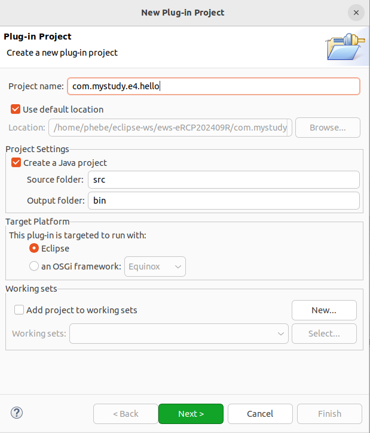
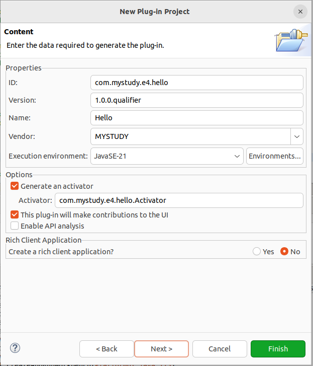
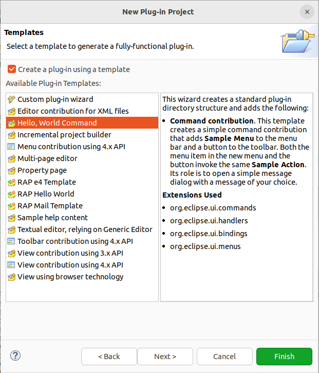
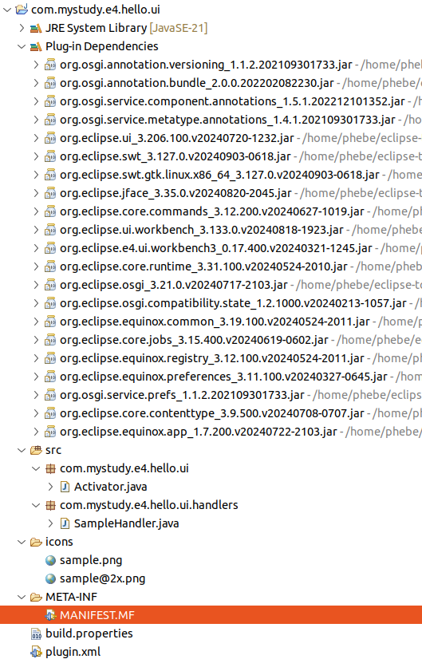
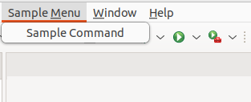
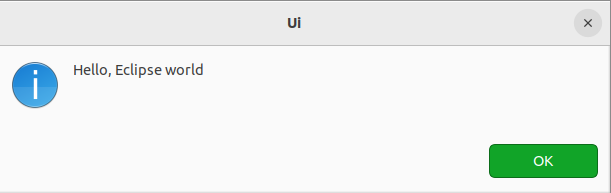

## 创建一个插件工程：Hello,World

### 检查并安装PDE插件

插件工程需要安装PDE（Plug-in Development Environment）插件，在我选择的 [Eclipse IDE for RCP and RAP Developers](https://www.eclipse.org/downloads/packages/release/2024-09/r/eclipse-ide-rcp-and-rap-developers) 包中就已经默认集成了 PDE插件。

如果没有安装 PDE 插件，请先安装。

### 创建工程&运行示例

1. "File" > "Plug-in Project" ；输入Project name ，插件通常以反向域名格式命名，如图类似的自己随便定义一个。



2. 注意两个复选框勾上；其它保持默认即可。



3. 勾上复选框，并在插件模版列表中选择 Hello，World Command模版。Finish即可。



4. 成功创建了工程。package 视图如下：



5. 运行：工程右键>Run as > Eclipse Application 。将会再启动一个Eclipse实例，菜单栏多出来一个 Sample Menu及一个Sample Command。点Sample Command，弹出下图所示窗口。

   

### 插件初步学习

插件工程主要的配置文件：

* META-INF/MANIFEST.MF ：MF: OSGi清单描述了插件的依赖项、版本和名称。双击它将打开一个自定义编辑器，Manifest遵循标准的Java约定；续行由后跟一个空格字符的新行表示，并且文件必须以新行结束。（例如，最大行长度为72个字符，尽管许多人忽略了这一点。）
* plugin.xml ： plugin.xml文件声明了这个插件为Eclipse运行时提供的扩展。并非所有插件都需要plugin.xml文件；无头（非ui）插件通常不需要一个。稍后将更详细地介绍扩展点，但是样例项目将为命令、处理程序、绑定和菜单扩展点创建扩展。（如果选择旧的Hello World模板，在3.7和更早的版本中，只有actionSets扩展将被使用。）
  命令、操作或菜单的文本标签在plugin.xml文件中以声明的方式表示，而不是以编程的方式表示；这允许Eclipse在需要加载或执行任何代码之前显示菜单.
  这就是Eclipse启动如此之快的原因之一；由于不需要加载或执行类，它可以通过显示当时需要的内容进行扩展，然后在用户调用操作时按需加载类。Java Swing的Actions以编程方式提供标签和工具提示，这可能导致用户界面初始化速度变慢.
* build.properties : 该文件由PDE在开发时和构建时使用。通常可以忽略它，但是如果添加了需要对插件可用的资源（例如图像、属性文件、HTML内容等），则必须在这里添加一个条目，否则将找不到它。通常，最简单的方法是转到构建的Build选项卡。属性文件，该文件将给出项目内容的树状视图。

#### META-INF/MANIFEST.MF

```
Manifest-Version: 1.0
Bundle-ManifestVersion: 2
Bundle-Name: Ui
Bundle-SymbolicName: com.mystudy.e4.hello.ui;singleton:=true
Bundle-Version: 1.0.0.qualifier
Bundle-Activator: com.mystudy.e4.hello.ui.Activator
Bundle-Vendor: MYSTUDY
Require-Bundle: org.eclipse.ui,
 org.eclipse.core.runtime
Bundle-RequiredExecutionEnvironment: JavaSE-21
Automatic-Module-Name: com.mystudy.e4.hello.ui
Bundle-ActivationPolicy: lazy

```

1. **Manifest-Version: 1.0**
   * 这是标准的 Java Archive (JAR) 文件清单的版本号。
2. **Bundle-ManifestVersion: 2**
   * 指定插件清单的版本。这里使用的是版本 2，这是 OSGi 规范中定义的版本。
3. **Bundle-Name: Ui**
   * 插件的名称，这个名称通常显示在 Eclipse 的插件管理界面中。
4. **Bundle-SymbolicName: com.mystudy.e4.hello.ui;singleton:=true**
   * 插件的符号名称，这是一个唯一标识符，用于引用插件。
   * `singleton:=true` 表示这个插件在 OSGi 环境中只能有一个实例。
5. **Bundle-Version: 1.0.0.qualifier**
   * 插件的版本号。`qualifier` 是一个占位符，通常在构建过程中被替换为具体的版本信息，如构建号。
6. **Bundle-Activator: com.mystudy.e4.hello.ui.Activator**
   * 指定插件的激活器类，这是一个实现了 `BundleActivator` 接口的类，用于在插件启动和停止时执行特定的操作。
7. **Bundle-Vendor: MYSTUDY**
   * 插件的供应商或组织名称。
8. **Require-Bundle: org.eclipse.ui, org.eclipse.core.runtime**
   * 列出插件依赖的其他插件。在这个例子中，插件依赖于 Eclipse 的 UI 和核心运行时插件。
9. **Bundle-RequiredExecutionEnvironment: JavaSE-21**
   * 指定插件运行所需的 Java 执行环境。这里指定的是 JavaSE-21，意味着插件需要 Java 21 或更高版本。
10. **Automatic-Module-Name: com.mystudy.e4.hello.ui**
    * 当插件被打包为模块化的 JAR 文件时，这个属性指定了模块的自动模块名称。这是为了兼容 Java 9 及以上版本的模块化系统。
11. **Bundle-ActivationPolicy: lazy**
    * 指定插件的激活策略。`lazy` 表示插件只有在真正需要时才会被激活，这有助于提高启动性能。

#### plugin.xml

```
<?xml version="1.0" encoding="UTF-8"?>
<?eclipse version="3.4"?>
<plugin>

   <extension
         point="org.eclipse.ui.commands">
      <category
            id="com.mystudy.e4.hello.ui.commands.category"
            name="Sample Category">
      </category>
      <command
            categoryId="com.mystudy.e4.hello.ui.commands.category"
            name="Sample Command"
            id="com.mystudy.e4.hello.ui.commands.sampleCommand">
      </command>
   </extension>
   <extension
         point="org.eclipse.ui.handlers">
      <handler
            class="com.mystudy.e4.hello.ui.handlers.SampleHandler"
            commandId="com.mystudy.e4.hello.ui.commands.sampleCommand">
      </handler>
   </extension>
   <extension
         point="org.eclipse.ui.bindings">
      <key
            commandId="com.mystudy.e4.hello.ui.commands.sampleCommand"
            schemeId="org.eclipse.ui.defaultAcceleratorConfiguration"
            contextId="org.eclipse.ui.contexts.window"
            sequence="M1+6">
      </key>
   </extension>
   <extension
         point="org.eclipse.ui.menus">
      <menuContribution
            locationURI="menu:org.eclipse.ui.main.menu?after=additions">
         <menu
               id="com.mystudy.e4.hello.ui.menus.sampleMenu"
               label="Sample Menu"
               mnemonic="M">
            <command
                  commandId="com.mystudy.e4.hello.ui.commands.sampleCommand"
                  id="com.mystudy.e4.hello.ui.menus.sampleCommand"
                  mnemonic="S">
            </command>
         </menu>
      </menuContribution>
      <menuContribution
            locationURI="toolbar:org.eclipse.ui.main.toolbar?after=additions">
         <toolbar
               id="com.mystudy.e4.hello.ui.toolbars.sampleToolbar">
            <command
                  id="com.mystudy.e4.hello.ui.toolbars.sampleCommand"
                  commandId="com.mystudy.e4.hello.ui.commands.sampleCommand"
                  icon="icons/sample.png"
                  tooltip="Say hello world">
            </command>
         </toolbar>
      </menuContribution>
   </extension>

</plugin>

```

 plugin.xml 文件片段中，有多个 `<extension>` 标签，每个都对应于不同的 Eclipse 扩展点。以下是每个 `<extension>` 标签及其子标签的说明：

1. **org.eclipse.ui.commands 扩展点** :

* `<category>`: 定义一个命令分类。
  * `name`: 分类名称，显示在 UI 中。
  * `id`: 唯一标识符，用于引用该分类。
* `<command>`: 定义一个命令。
  * `name`: 命令名称，显示在 UI 中。
  * `categoryId`: 指定该命令所属的分类的 ID。
  * `id`: 唯一标识符，用于引用该命令。

1. **org.eclipse.ui.handlers 扩展点** :

* `<handler>`: 定义一个命令的处理程序。
  * `commandId`: 指定该处理程序对应的命令的 ID。
  * `class`: 指定实现该处理程序的 Java 类。

1. **org.eclipse.ui.bindings 扩展点** :

* `<key>`: 定义一个键盘快捷键绑定。
  * `commandId`: 指定该快捷键绑定的命令的 ID。
  * `contextId`: 指定快捷键生效的上下文（例如，全局、编辑器等）。
  * `sequence`: 指定快捷键的按键组合。
  * `schemeId`: 指定快捷键配置方案的 ID。

1. **org.eclipse.ui.menus 扩展点** :

* `<menuContribution>`: 定义一个菜单贡献。
  * `locationURI`: 指定菜单贡献的位置。
  * `<menu>`: 定义一个菜单。
    * `label`: 菜单的显示标签。
    * `mnemonic`: 菜单的键盘助记符。
    * `id`: 唯一标识符，用于引用该菜单。
    * `<command>`: 在菜单中添加一个命令。
      * `commandId`: 指定菜单项对应的命令的 ID。
      * `mnemonic`: 命令的键盘助记符。
      * `id`: 唯一标识符，用于引用该命令。
* `<toolbar>`: 定义一个工具栏。
  * `id`: 唯一标识符，用于引用该工具栏。
  * `<command>`: 在工具栏中添加一个命令。
    * `commandId`: 指定工具栏项对应的命令的 ID。
    * `icon`: 指定命令的图标。
    * `tooltip`: 指定命令的工具提示文本。
    * `id`: 唯一标识符，用于引用该命令。

这些扩展点和子标签共同定义了插件在 Eclipse 环境中的行为和用户界面元素。例如，定义了一个命令分类、一个命令、命令的处理程序、键盘快捷键、菜单和工具栏项。这些元素在 Eclipse 界面中呈现，并允许用户与插件交互。

#### build.properties

```
source.. = src/
output.. = bin/
bin.includes = plugin.xml,\
               META-INF/,\
               .,\
               icons/

```

在 Eclipse 插件开发中，`build.properties` 文件用于配置插件项目的构建过程。这个文件告诉 PDE（Plugin Development Environment）哪些文件和目录应该包含在最终的插件 JAR 文件中，以及源代码和输出目录的位置。以下是您提供的 `build.properties` 文件内容的详细说明：

1. **source… = src/**
   * `source..` 属性指定了插件项目的源代码目录。在这个例子中，源代码位于项目目录下的 `src` 目录。
   * `..` 表示这是一个递归属性，意味着 `src` 目录及其所有子目录中的文件都将被视为源代码。
2. **output… = bin/**
   * `output..` 属性指定了编译后的类文件和其他生成资源的输出目录。在这个例子中，输出目录是项目目录下的 `bin` 目录。
   * 同样，`..` 表示这是一个递归属性，所以 `bin` 目录及其所有子目录中的文件都是构建输出的结果。
3. **bin.includes = plugin.xml,**
   * `bin.includes` 属性列出了需要包含在最终插件 JAR 文件中的文件和目录。这个列表是以逗号分隔的，每个条目都可以是一个文件、目录或模式匹配表达式。
   * `plugin.xml` 是插件的配置文件，它定义了插件的行为和扩展点。
4. **META-INF/,**
   * `META-INF/` 目录通常包含插件的清单文件（MANIFEST.MF）和其他元数据文件。这个目录必须包含在最终的 JAR 文件中。
5. **.,**
   * `.` 表示当前目录（即项目的根目录）。在这里列出 `.` 意味着项目根目录中的所有文件都应该包含在最终的 JAR 文件中。
6. **icons/**
   * `icons/` 目录包含插件可能使用的图标资源。这个目录及其内容也会被包含在最终的 JAR 文件中。

总结来说，这个 `build.properties` 文件配置了插件项目的源代码和输出目录，并指定了哪些文件和目录应该被打包到最终的插件 JAR 文件中。这对于确保插件在 Eclipse 环境中正确构建和运行至关重要。

### 总结

目前 Eclipse 已有的 `extension` 及 point 的了解和学习还需要继续深入。需要知道有哪些 `extension`，效果如何，以及结合需求怎么使用。

亦或者可能还需要能够自定义 `extension` ？

更多关于扩展点的说明和学习：

* [Eclipse Extension Points and Extensions - Tutorial](https://www.vogella.com/tutorials/EclipseExtensionPoint/article.html)
* [Plug-in Extension Points](https://help.eclipse.org/latest/index.jsp?topic=%2Forg.eclipse.pde.doc.user%2Fguide%2Ftools%2Feditors%2Fmanifest_editor%2Fextension_points.htm)
* [FAQ How do I declare my own extension point?](https://wiki.eclipse.org/FAQ_How_do_I_declare_my_own_extension_point%3F)
