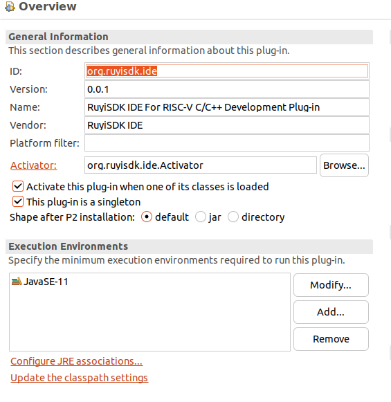

# 开发第一个插件

目标：

1. 创建一个RuyiSDK菜单
2. 菜单下有个命令：能够打开RuyiSDK官网
3. 插件导出与安装

## 插件的创建

参考[文档](/chapter2-pluginDev/2.1-firstplugin-hello.md)创建工程，当然相关属性还是有必要按照需求定义成方便理解的。

- 新建一个plugin工程：org.ruyisdk.ide；版本设置为0.0.1 ；创建的时候选模版：hello，world command
  

## 按照需求修改和开发

1. 修改plugin.xml 文档中的相关参数和定义，最终效果详见[源码](https://github.com/xijing21/eclipse-plugins/blob/198b0c537c125159bcdff3469309c5e7805517a0/org.ruyisdk.ide/plugin.xml)

   - 参考资料：
     - [Platform Extension Points](https://help.eclipse.org/latest/topic/org.eclipse.platform.doc.isv/reference/extension-points/index.html?cp=2_1_1 "Extension Points Reference")
     - [Eclipse Platform API Specification](https://help.eclipse.org/latest/topic/org.eclipse.platform.doc.isv/reference/api/overview-summary.html?cp=2_1_0 "API Reference")
   - 实践建议：对照源码和效果，结合官方文档学习理解。
2. 修改实现需求事件: [SampleHandler.java](https://github.com/xijing21/eclipse-plugins/blob/198b0c537c125159bcdff3469309c5e7805517a0/org.ruyisdk.ide/src/org/ruyisdk/ide/handlers/SampleHandler.java)

## 插件的导出与安装

详见下一节[文档](/chapter2-pluginIntro/2.4-exportAndInstall.md)。
