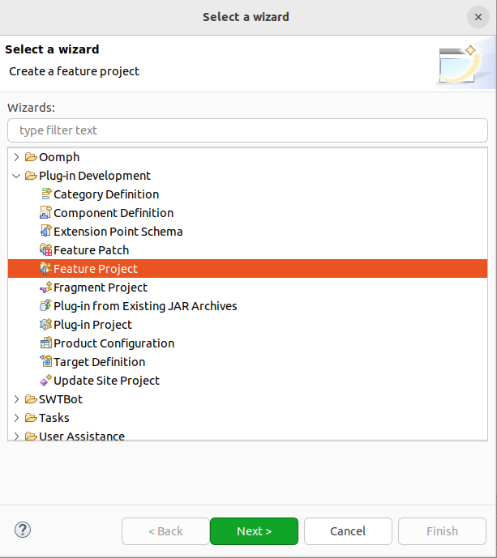

# Eclipse的插件的导出与安装

三种不同导出和安装方式

插件的导出和安装方式，据我目前了解的而言，可以细分为3种不同的方式，每种方式是操作上递进的，我按照顺序说明：

- 第一种：plug-in project 直接导出成 jar，将 jar 拷贝到 RuyiSDK IDE 根目录 plugins目录（dropins下亦可）下重启运行
- 第二种：通过 Install New Software + 本地发布件（可以是目录、可以是本地zip）方式安装
- 第三种：通过Install New Software + web发布件url地址方式安装

## 第一种：jar

1. 准备好要导出的插件工程（plug-in project）。 可参考[前一章节](/chapter2-pluginIntro/2.3-firstpluginDev.md)
   
2. 右键工程 > Export > Plug-in Development > Develyable plug-ins and fragments
   
3. 设置导出选项：
   - Destination：Directory 和 Archive file（导出为 zip 文件） 两种都可以，我都试过ok；
     
   - Options：基本保持默认即可，注意需要勾选 Package plug-ins as individual JAR archives
     
   - JAR Signing：可不设置
4. Finish，导出后：
   
5. 在IDE种安装插件：
   直接将上述 jar 文件 拷贝到 IDE 的根目录下的 plugins目录即可（dropins目录也可，但是放 plugins 更规范）。
6. 重启 IDE 运行看效果。
   [运行效果](image/install1.gif)

## 第二种：Install New Software + 本地发布件

1. 前置条件：在已有上述plug-in project（ org.ruyisdk.ide）的基础上继续执行。
2. 再新建一个 Feature Project （我这边命名：）
   
   
   
   
   创建完成有两个文件。
3. File > New > Other > Plug-in Development > Category Definition (找不到可以通过搜索方式)
   

   注意：这里选择要将 catagory.xml 添加到哪个 Feature Project
   

   
4. 编辑 catagory.xml ：

   1. New Category
      
      
   2. Add Feature：选择 Feature Project
      
   3. Add Plug-in：选择最初创建的 Plugin Project
      
5. 右键 Feature Project : Export > Plug-in Development > Deployable features
   
   
   
   对Options选线进行配置，主要配置 Categorize repository，点击Browse,选择 category.xml 文件。
6. 导出的成果：
   
7. 安装：
   在 IDE 种，Help > Install New Software > Add >  Local 选择导出的插件路径即可。
   详见[安装过程和效果示意图](image/install2.gif)

## 第三种：Install New Software + web发布件

1. 前置条件：在已有上述 Plug-in Project 、Feature Project+Category Definition 的前提下，继续。
2. 新建一个 Update Site Project：File > New > Other > Plug-in Development > Update Site Project
   
   
   
   创建完成后会生成一个 site.xml 文件；
3. 编辑 site.xml 文件：

   1. New Category
   2. Add Feature：选择之前创建的Feature Project。
   3. 点击 Build 按钮，就会发现  Update Site Project 工程中多了很多文件(之前第二种方式导出的产物)
      

   到这里，就基本上已经准备好了发布到web服务器所需的文件了（保持文件目录结构）：一个包含artifacts.jar、content.jar、features、plugins、site.xml 文件和目录的目录结构。
   
4. 将产物发布到web服务器。
   将上述导出的目录上传到你的Web服务器上。确保这个目录可以通过HTTP或HTTPS协议访问。
   如果你没有Web服务器，可以考虑使用GitHub Pages、GitLab Pages、Bitbucket Pipelines等服务来托管你的更新站点。

   这里我以 GitHub Pages 作为web服务器，来测试发布和安装效果：

   1. 将这个包含artifacts.jar、content.jar、features、plugins、site.xml 文件和目录的目录结构上传到 仓库的 [gh-pages分支](https://github.com/xijing21/eclipse-plugins/tree/gh-pages)
   2. 通过github pages 发布 gh-pages分支：
      
   3. 记住 site url：如我的是 https://xijing21.github.io/eclipse-plugins/
5. 在IDE中安装插件：
   在 IDE 种，Help > Install New Software > Add > Work with：填入site url地址； 选择导出的插件路径即可。
   详见[安装过程和效果示意图](image/install3.gif)

说明：web服务器发布的是目录，且是一个包含artifacts.jar、content.jar、features、plugins、site.xml 文件和目录的目录结构。不能是zip文件等压缩格式。为了方便传输，是可以通过先压缩再解压的方式进行文件传输的。可以直接通过压缩命令压缩，也可以通过对 Update Site Project执行 Export > General > Archive File 来导出zip文件。

## 问题

1. 插件原本是使用的 jdk 11，但是在 Plugin Project 导出的时候就因为版本兼容性报错，随后改成 jdk 21后可以导出了。这个版本兼容性的问题是开发IDE与project java version版本不兼容的问题么？需要进一步分析和解决，否则后续与 embed cdt 插件版本可能不兼容。
2. 除了这种方式导出，还有其它方式么？或许可以参考 https://github.com/eclipse-embed-cdt/eclipse-plugins 看看是如何处理插件构建发布的问题的。
