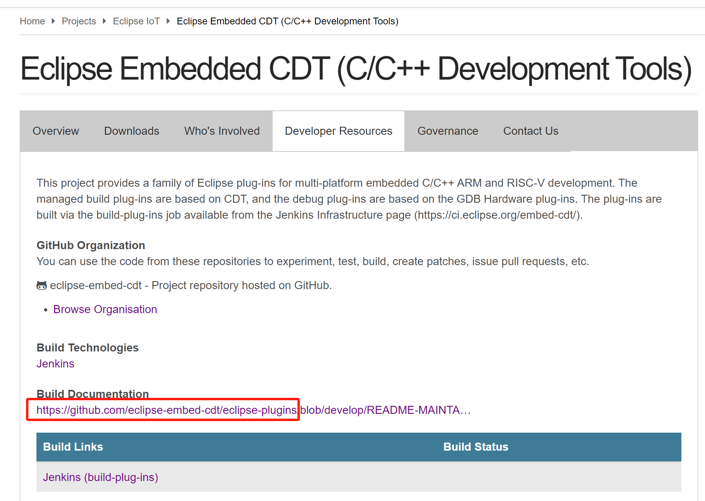
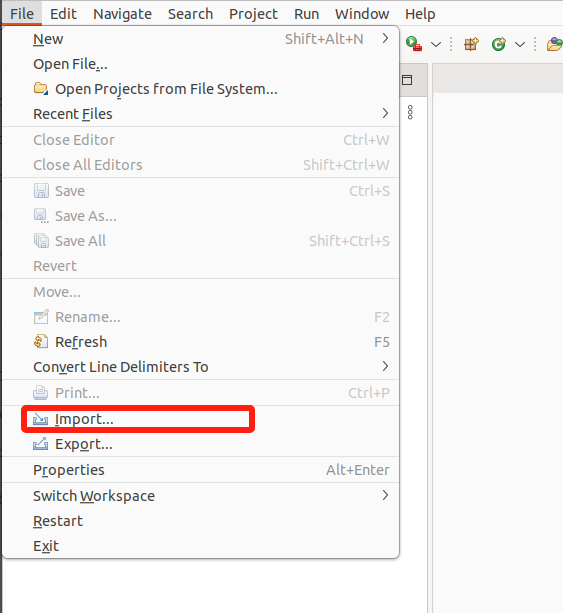
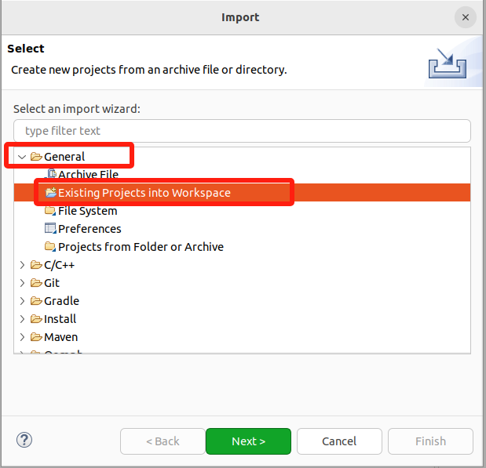
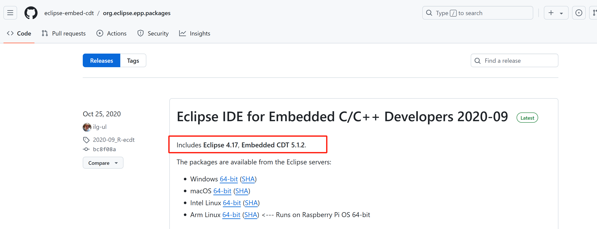
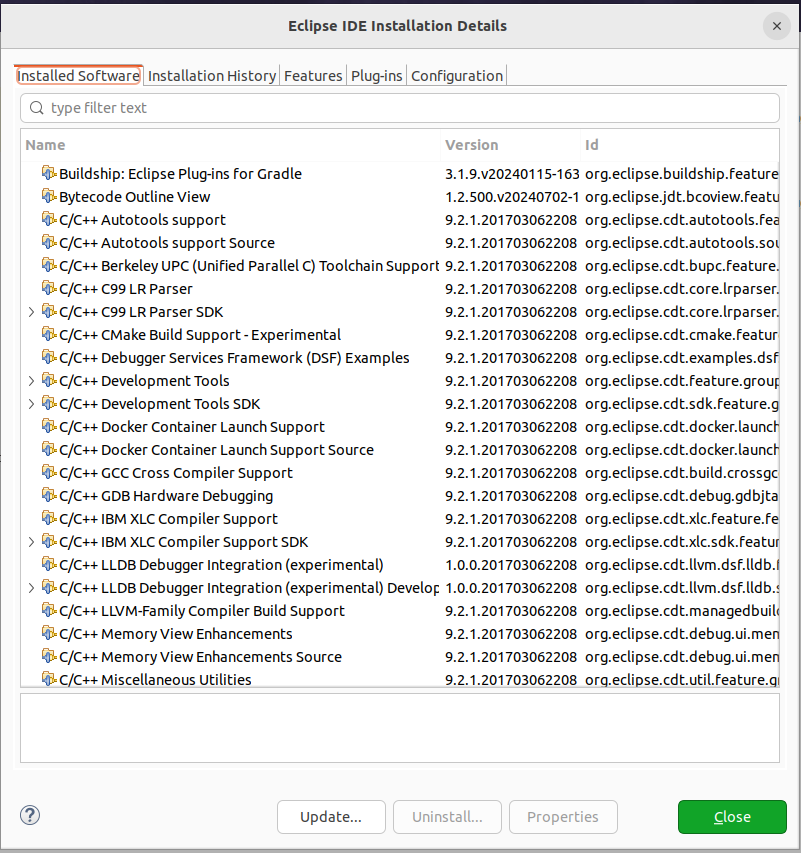

## 了解embeded cdt仓库和源码

### 找到源码仓

1. 网页：https://projects.eclipse.org/projects/iot.embed-cdt/developer
   
2. 直接github上搜索。github 搜索：embedded cdt

* https://github.com/eclipse-embed-cdt
  * **仓库：https://github.com/eclipse-embed-cdt/eclipse-plugins**
  * https://eclipse-embed-cdt.github.io/develop/build-prerequisites/
* https://github.com/eclipse-cdt/cdt

### 基于eclipse-embed-cdt的二次开发

仔细阅读readme：https://github.com/eclipse-embed-cdt/eclipse-plugins/blob/develop/README-MAINTAINER.md

#### 源码准备

为了避免最新版本的代码存在不可预见的错误，基于最新的release版本 v6.6.1，下载对应的源码，在该版本上进行再开发。

```
wget https://github.com/eclipse-embed-cdt/eclipse-plugins/archive/refs/tags/v6.6.1.tar.gz
tar -xvzf v6.6.1.tar.gz -C ./eclipse-plugins-v6.6.1
```

解压后的源码位置：/home/phebe/eclipse-build/eclipse-plugins-v6.6.1/eclipse-plugins-6.6.1

#### 工程导入






在新的工作空间中，需要预先安装EclipseCDT插件，

#### 插件导入

容易出错的插件开发环境搭建方式

正确的搭建方式

#### 先决条件

https://github.com/eclipse-embed-cdt/org.eclipse.epp.packages/releases/




上述是特别早古的版本的归档，近期的版本则没有；在https://github.com/eclipse-embed-cdt/eclipse-plugins 中没有找到cdt的对应版本的下载链接。

继续github 搜索 cdt ：https://github.com/eclipse-cdt/cdt

在release中寻找  CDT 9.2.1 (Neon.3) 版本： https://github.com/eclipse-cdt/cdt/tags?after=CDT_9_4_0


这里只提供了源码，未提供二进制。


仔细读仓库的readme文档：


https://github.com/eclipse-cdt/cdt/blob/main/Downloads.md  

这里可以下载编译后的插件。


**通过本地文件安装** :

* 如果您已经下载了插件的文件（通常是 `.zip`或 `.jar`格式），在Help—> `Install New Software...` 界面中，点击 `Add...` 按钮，选择解压后的cdt根目录（不用选择某个jar文件）。
* 选择 `Archive...`，然后导航到您下载的插件文件。
* 添加完插件后，按照提示完成安装过程。


注意，整个安装过程可能持续十几分钟，安装完成后会提示重新启动eclipse。

重启eclipse后，我们首先可以看到：





#### 参考资料

https://blog.csdn.net/gitblog_01168/article/details/142777547?utm_medium=distribute.pc_relevant.none-task-blog-2~default~baidujs_baidulandingword~default-0-142777547-blog-124730914.235^v43^pc_blog_bottom_relevance_base7&spm=1001.2101.3001.4242.1&utm_relevant_index=3
