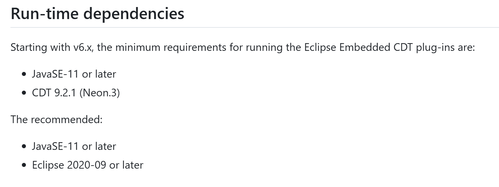
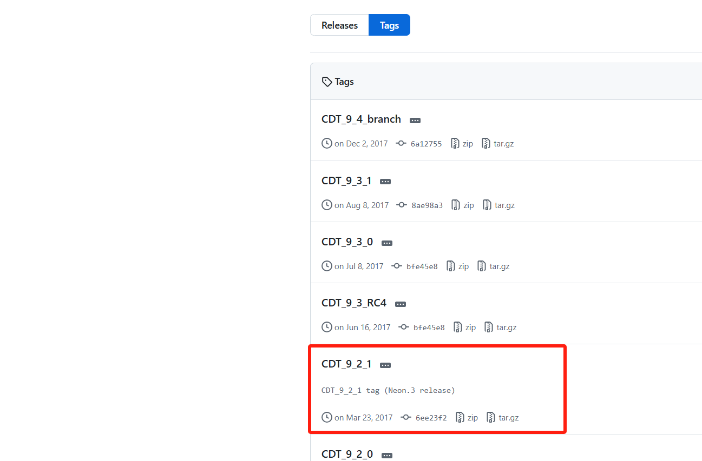
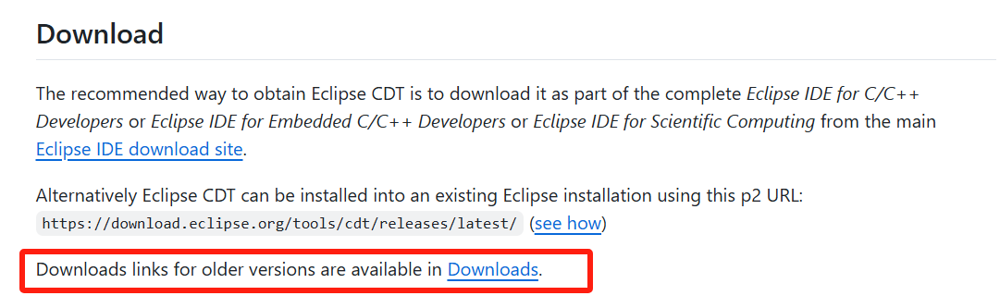
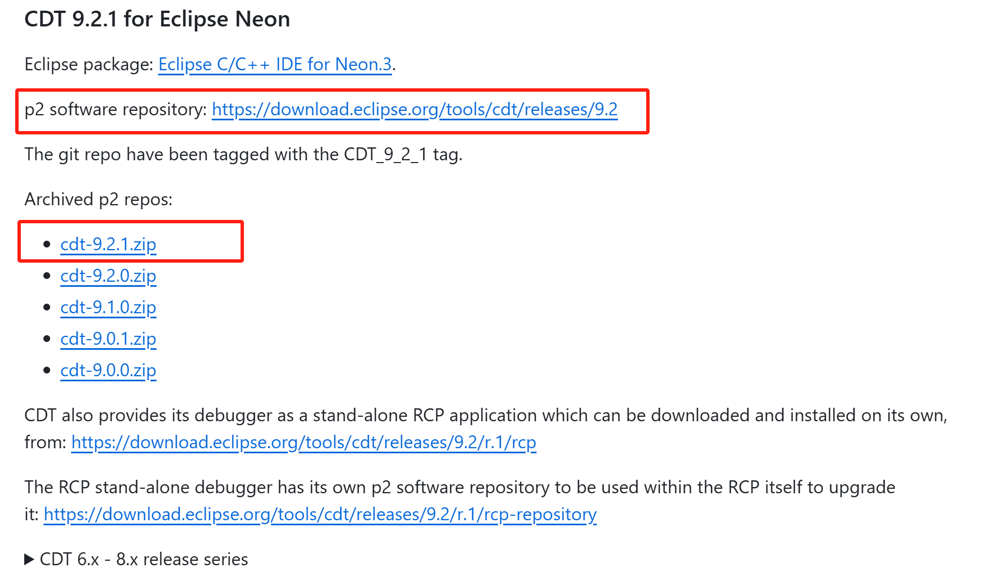
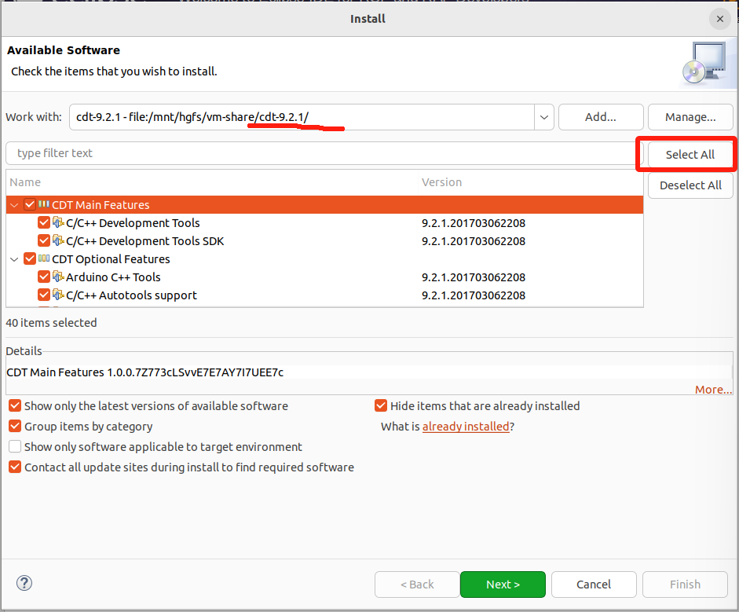
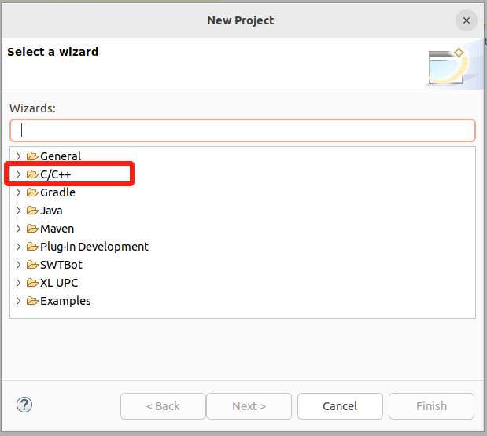
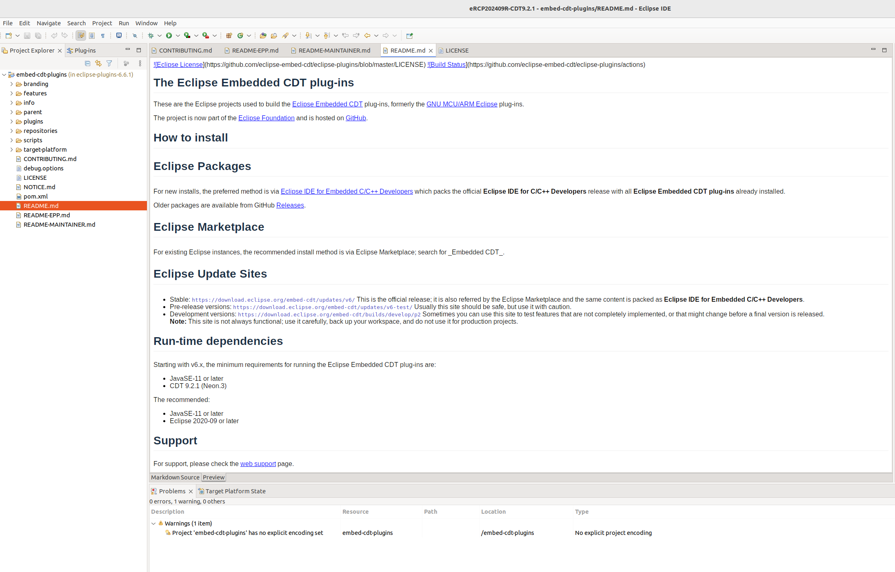

## 了解embeded cdt仓库和源码

### 找到源码仓

#### 查询方法

1. 网页：https://projects.eclipse.org/projects/iot.embed-cdt/developer
   
2. 直接github上搜索。github 搜索：embedded cdt

#### 仓库地址

* [Eclipse Embedded CDT (C/C++ Development Tools)](https://github.com/eclipse-embed-cdt) : https://github.com/eclipse-embed-cdt
  * **插件仓库：https://github.com/eclipse-embed-cdt/eclipse-plugins**
  * 文档：https://eclipse-embed-cdt.github.io/develop/build-prerequisites/
* [CDT](https://github.com/eclipse-cdt/cdt) : https://github.com/eclipse-cdt/cdt

### 了解 eclipse-embed-cdt

- 目标仓库：https://github.com/eclipse-embed-cdt/eclipse-plugins
- 文档：仓库readme：https://github.com/eclipse-embed-cdt/eclipse-plugins/blob/develop/README-MAINTAINER.md

#### 源码准备

为了避免最新版本的代码存在不可预见的错误，基于最新的release版本 v6.6.1，下载对应的源码，在该版本上进行再开发。

```
wget https://github.com/eclipse-embed-cdt/eclipse-plugins/archive/refs/tags/v6.6.1.tar.gz
tar -xvzf v6.6.1.tar.gz -C ./eclipse-plugins-v6.6.1
```

解压后的源码位置：/home/phebe/eclipse-build/eclipse-plugins-v6.6.1/eclipse-plugins-6.6.1

#### 工程导入


在新的工作空间中，需要预先安装EclipseCDT插件。（缺CDT插件是预期会出现的问题）

### 为开发环境导入CDT插件

> 注意：在安装 CDT 插件的时候，非常容易直接从 Eclipse MarketPlace 直接搜索安装，这种安装方式不方便控制安装的 CDT 版本，后续工程报各种错误。正确的安装方式是先仔细阅读和了解本仓库的代码对 CDT 的版本要求，按照对应的版本。

#### 先决条件

1. 在 README中我们可以找到相关描述：



#### 安装 CDT 9.2.1

安装CDT 9.2.1 版本插件。

插件的安装在之前介绍了2种方法，第一种从 Eclipse MarketPlace 直接搜索安装，暂时似乎不容易控制版本，会默认按照最新 CDT 版本。

采用第二种方法，需要找到 CDT 9.2.1 下载地址。

3. 明确说明了需要 Java 11及以上版本，CDT 9.2.1版本，Eclipse 2020-09版本及以后；


[这里](https://github.com/eclipse-embed-cdt/org.eclipse.epp.packages/releases/)只找到早古的版本的归档，近期的版本则没有；在https://github.com/eclipse-embed-cdt/eclipse-plugins 中没有找到cdt的对应版本的下载链接。

继续 github 搜索 cdt，找到 cdt 插件仓库寻找 ：https://github.com/eclipse-cdt/cdt

在release中寻找  CDT 9.2.1 (Neon.3) 版本： https://github.com/eclipse-cdt/cdt/tags?after=CDT_9_4_0



这里只提供了源码，未提供二进制。

仔细读 cdt 仓库的readme文档：



点击 上述链接：https://github.com/eclipse-cdt/cdt/blob/main/Downloads.md  ，可以下载编译后的插件。



**通过本地文件安装** :

* 如果您已经下载了插件的文件（通常是 `.zip`或 `.jar`格式），在Help—> `Install New Software...` 界面中，点击 `Add...` 按钮，选择解压后的cdt根目录（不用选择某个jar文件）。
* 选择 `Archive...`，然后导航到您下载的插件文件。或者输入 p2 software repository 地址 : https://download.eclipse.org/tools/cdt/releases/9.2
* 添加完插件后，按照提示完成安装过程。



注意，整个安装过程可能持续十几分钟，安装完成后会提示重新启动eclipse。

#### 安装后验证

重启eclipse后，我们首先可以看到 Eclipse 支持 C/C++工程的创建了，还有也能查到 CDT插件安装成功了；此外之前导入的工程的 Error 已经解决了。






### Embed 插件

直接阅读源码，了解 Embeded CDT 插件的组成。发现源码仓库的 https://github.com/eclipse-embed-cdt/eclipse-plugins/tree/develop/plugins 下面有很多的插件：

- 从插件的命名上可以看出，这就是需求关联度最高的相关插件，完善或者仿照这些插件进行开发能扩展 RISC-V 开发板的支持需求。
- 从单个插件如 [org.eclipse.embedcdt.core](https://github.com/eclipse-embed-cdt/eclipse-plugins/tree/develop/plugins/org.eclipse.embedcdt.core) 目录下的文件组成可以看出（.project 文件等）这是一个独立的 Eclispe Plugin Project。因此后续的开发可以导入这些源码进行开发。

接下来就看导入 plugins 目录下的 插件工程，并理解和学习这些插件。
