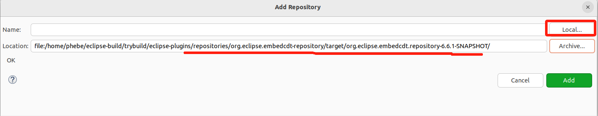
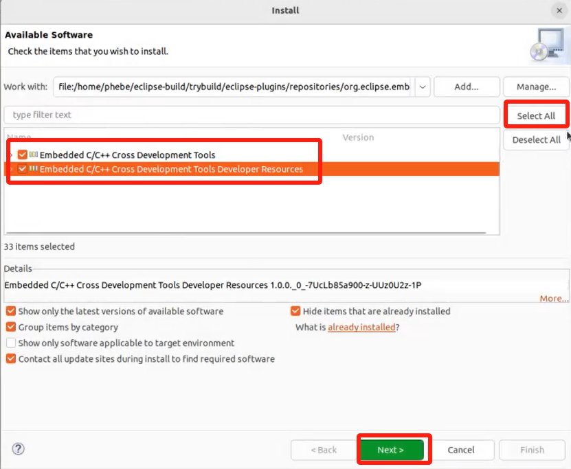
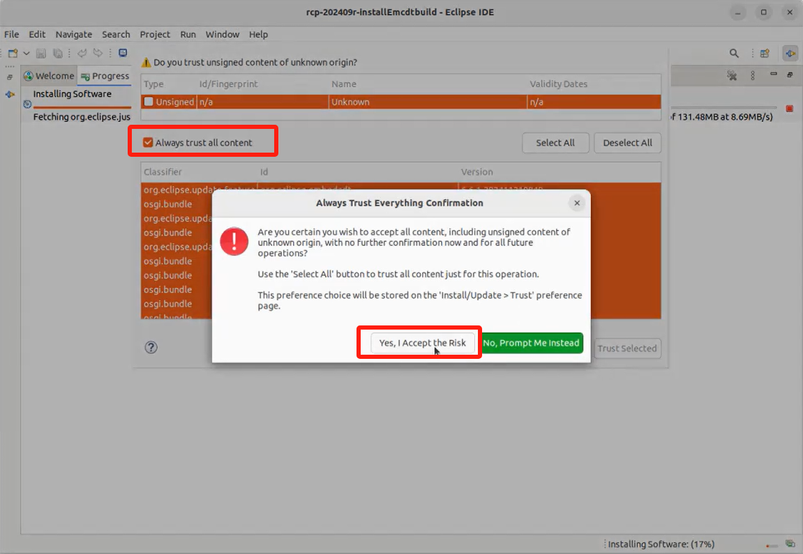
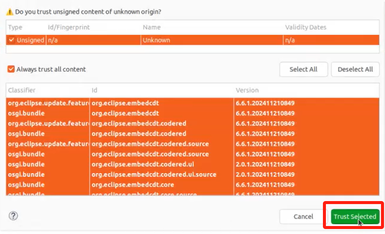
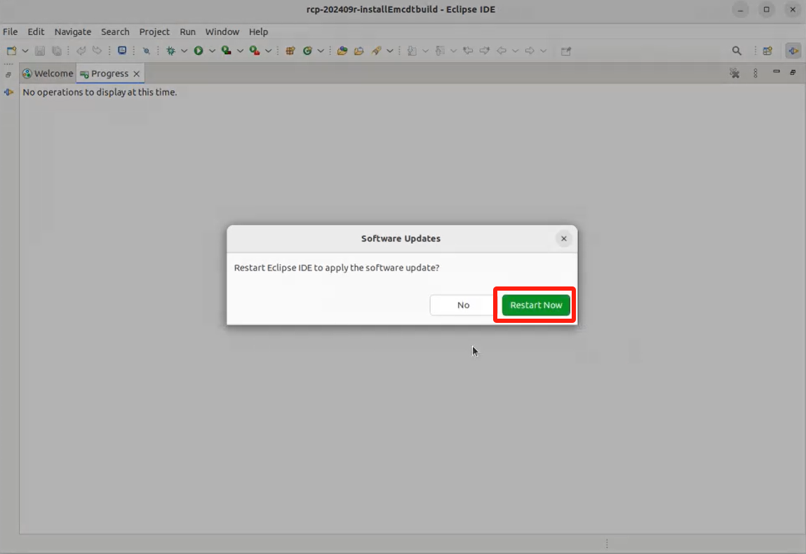
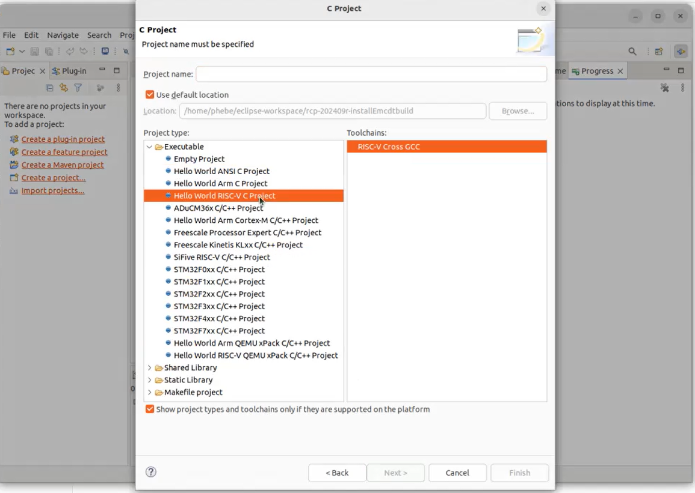

## 了解embeded cdt仓库和源码

### 找到源码仓

#### 查询方法

1. 网页：https://projects.eclipse.org/projects/iot.embed-cdt/  的 developer 标签页中查看：
2. 
3. 直接github上搜索。github 搜索：embedded cdt

#### 仓库地址

* [Eclipse Embedded CDT (C/C++ Development Tools)](https://github.com/eclipse-embed-cdt) : https://github.com/eclipse-embed-cdt

  * **插件仓库：https://github.com/eclipse-embed-cdt/eclipse-plugins**

    * 文档：
      - [README](https://github.com/eclipse-embed-cdt/eclipse-plugins/blob/develop/README.md)
      - [README-MAINTAINER](https://github.com/eclipse-embed-cdt/eclipse-plugins/blob/develop/README-MAINTAINER.md)
      - https://eclipse-embed-cdt.github.io/develop/build-prerequisites/
  * 其它仓库：

    * [eclipse-embed-cdt.github.io](https://github.com/eclipse-embed-cdt/eclipse-embed-cdt.github.io) 、[web-preview](https://github.com/eclipse-embed-cdt/web-preview) 、[web-jekyll](https://github.com/eclipse-embed-cdt/web-jekyll)  与静态网站有关；
      * [web-jekyll](https://github.com/eclipse-embed-cdt/web-jekyll)：用于生成项目静态网页的 Jekyll 源代码。
      * [eclipse-embed-cdt.github.io](https://github.com/eclipse-embed-cdt/eclipse-embed-cdt.github.io) ：The Eclipse Embedded CDT web static site.
      * [web-preview](https://github.com/eclipse-embed-cdt/web-preview) ：web-Jekyll内容的预览
    * [org.eclipse.epp.packages](https://github.com/eclipse-embed-cdt/org.eclipse.epp.packages) ：用于生成可分发二进制文件的Eclipse项目的分支，扩展包含Eclipse嵌入式CDT插件。
    * [.eclipsefdn](https://github.com/eclipse-embed-cdt/.eclipsefdn) ：用于托管与Eclipse基金会相关的配置的仓库。
    * [Liqp](https://github.com/eclipse-embed-cdt/Liqp) ：基于 ANTLR 的“Liquid 模板”解析器和渲染引擎。
* [CDT](https://github.com/eclipse-cdt/cdt) : **https://github.com/eclipse-cdt/cdt**

### 了解 eclipse-plugins

#### 源码解读

- 仓库：https://github.com/eclipse-embed-cdt/eclipse-plugins

  - maven工程
  - [pom.xml](https://github.com/eclipse-embed-cdt/eclipse-plugins/blob/develop/pom.xml "pom.xml") ： module中主要定义了 plugins、features、branding 。
  - [plugins](https://github.com/eclipse-embed-cdt/eclipse-plugins/tree/develop/plugins)：插件包括core、ui、coderd、debug、doc、build、template等诸多插件，从命名上基本与功能相对应。
  - [features](https://github.com/eclipse-embed-cdt/eclipse-plugins/tree/develop/features "features")：功能配置文件，将插件组装在一起形成一个更完整的功能。
  - [branding](https://github.com/eclipse-embed-cdt/eclipse-plugins/tree/develop/branding "branding")：指的是与品牌相关的资源，包括标志、颜色、字体等，用于塑造和传达插件的品牌形象。这些资源帮助用户识别和记住插件，从而增强其市场竞争力。
- 文档：

  - [README](https://github.com/eclipse-embed-cdt/eclipse-plugins/blob/develop/README.md)
    - Run-time dependencies
  - [README-MAINTAINER](https://github.com/eclipse-embed-cdt/eclipse-plugins/blob/develop/README-MAINTAINER.md)
    - Build locally

#### 本地构建

1. To clone it, be sure the submodules are also cloned:

   ```
   git clone --recurse-submodule https://github.com/eclipse-embed-cdt/eclipse-plugins eclipse-plugins.git
   ```
2. for local builds, use the [Adopt OpenJDK 11](https://adoptopenjdk.net/) and maven 3.6.

   在本地环境中安装 OpenJDK 11 以及 maven 3.6，如果环境中有多个JDK或者Maven版本，建议设置环境变量来确保版本正确：

   ```
   vim ~/.bashrc
   export JAVA_HOME=/usr/lib/jvm/java-1.11.0-openjdk-amd64
   export MAVEN_HOME=/usr/share/maven
   export PATH=$JAVA_HOME/bin:$MAVEN_HOME/bin:$PATH

   source ~/.bashrc

   java -version
   mvn -version
   ```
3. Run maven

   After fixing issues, run the maven build locally:

   ```shell
   mvn clean verify


   # 如果上述本地构建出现问题，可以尝试：
   mvn clean verify -Djava.home=/path/to/openjdk11   #使用 -Djava.home 参数显式指定 Java 运行时环境
   mvn clean verify -X  #-X 参数来启用 Maven 的调试输出，这样可以看到 Maven 在构建过程中使用的具体配置和参数，从而进一步诊断问题。
   ```

   Start a Debug/Run session and try the result in a child Eclipse.

   [问题与解决办法](./error-mvnbuild.md)
4. 在 项目的 repositories/org.eclipse.embedcdt-repository/target  目录下可以找到构建成功的打包文件.

   

   当我们对代码进行修改后，再执行这个构建过程，就能够得到我们二创后的插件，安装到Eclipse后能够获得自定义的功能。

   > 备忘：操作路径 /home/phebe/eclipse-build/trybuild/eclipse-plugins.git/
   >

### 在Eclipse中操作

#### 导入工程

1. 获取代码

   为了避免最新版本的代码存在不可预见的错误，基于最新的release版本 v6.6.1，下载对应的源码，在该版本上进行再开发。

   ```
   git clone https://github.com/eclipse-embed-cdt/eclipse-plugins.git
   cd eclipse-plugins
   git checkout 4ed6716bde76d57f542013eb3bacc692fda8d6c7   #v6.6.1的commitid

   # 下面这种方式获取代码不行，后面在执行mvn clean verify的时候会因为git问题报错 One of setGitDir or setWorkTree must be called ，需要通过git clone的方式获取带.git信息的源码
   # wget https://github.com/eclipse-embed-cdt/eclipse-plugins/archive/refs/tags/v6.6.1.tar.gz
   # tar -xvzf v6.6.1.tar.gz -C ./eclipse-plugins-v6.6.1
   ```

   解压后的源码位置：/home/phebe/eclipse-build/eclipse-plugins-v6.6.1/eclipse-plugins-6.6.1
2. 导入工程

   

   

   

   

#### 构建

3. Eclipse中执行构建
   选中工程 > "Run as" > "Maven build" , 对照下图进行设置。

   > 尤其要注意 maven 和 openjdk 的版本，要设置为正确的版本。Goals 按照目的设置，对照前面的本地构建说明可以设置为 clean verify，也可以定义为 install等；
   >

   
   
   
4. 点击 Run 之后，可以在 Console 视窗中查看执行的情况：
   
5. 执行完后，在 repositories/org.eclipse.embedcdt-repository/target 下生成了 zip文件，

   

> 备忘：操作路径  /home/phebe/eclipse-build/trybuild/eclipse-plugins/

#### 安装自构建的插件

> 下面的操作，请换成自己环境中对应的路径和文件名。这里只是一个实例，主要介绍步骤。

1. 新解压一个Eclipse（我这里操作的是 eclipse-rcp-2024-09-R-linux-gtk-x86_64.tar.gz）
2. 打开解压的Eclipse，重新创建一个Eclipse空间（我这里操作的是  eclipse-workspace/rcp-202409r-installEmcdtbuild）
   > 上面这两步主要是为了创建一个相对纯净的环境，也对比安装插件之前和安装之后的区别。
   >
3. 找到我们之前自构建的embedcdt的位置(我这里是  eclipse-plugins/repositories/org.eclipse.embedcdt-repository/target/org.eclipse.embedcdt.repository-6.6.1-SNAPSHOT.zip)，解压缩到org.eclipse.embedcdt.repository-6.6.1-SNAPSHOT
4. 在上述新开的“未额外安装插件的”Eclipse中，安装上述org.eclipse.embedcdt.repository-6.6.1-SNAPSHOT
   1. Eclipse > Help > Install New SoftWare;
   2. Add >  Local
   3. 找到并选中上面的解压后的org.eclipse.embedcdt.repository-6.6.1-SNAPSHOT（最后路径到org.eclipse.embedcdt.repository-6.6.1-SNAPSHOT 即可）；最后 Add

      
   4. Select All >  Next
      
   5. 按照向导一路Next。安装过程或持续好几分钟，可以在Eclipse的右下角点击“Installing Software+进度”处展开 Progress视窗查看详情。
   6. 后面会弹出“信任”选型窗口：
      勾选：Always trust content
      点击：Yes，I Accept the Risk
      点击：Trust Selected
      
      
   7. 按照提示重启Eclipse：

      
   8. 在新启动的Eclipse中体验 Embeded-cdt功能。可以执行 New C Project，发现创建工程的页面加入了很多嵌入式和RISC-V的功能和提示。说明Embeded-cdt插件安装成功。

      

## 下一步

本节通过了解eclipse-plugins知道其核心是 plugins 和 features 目录下的插件和功能组件。

以源码仓库的 https://github.com/eclipse-embed-cdt/eclipse-plugins/tree/develop/plugins 为例，发现：

- 从插件的命名上可以看出，这就是需求关联度最高的相关插件，完善或者仿照这些插件进行开发能扩展 RISC-V 开发板的支持需求。
- 从单个插件如 [org.eclipse.embedcdt.core](https://github.com/eclipse-embed-cdt/eclipse-plugins/tree/develop/plugins/org.eclipse.embedcdt.core) 目录下的文件组成可以看出（.project 文件等）这是一个独立的 Eclispe Plug-in Project。因此后续的开发可以导入这些源码进行开发。

接下来就看导入 plugins 目录下的 Plug-in Project，以及 features 目录下的 Featrue Project，进一步的学习和理解，并去修改代码。
