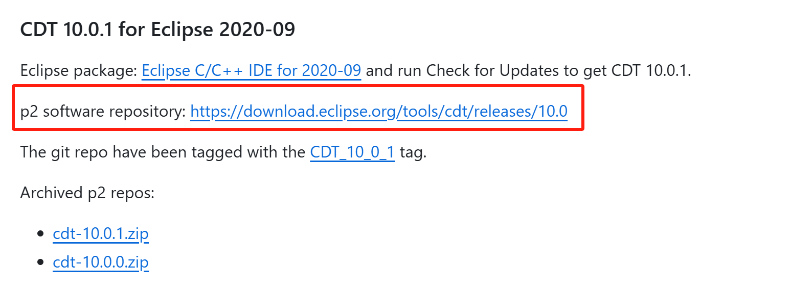
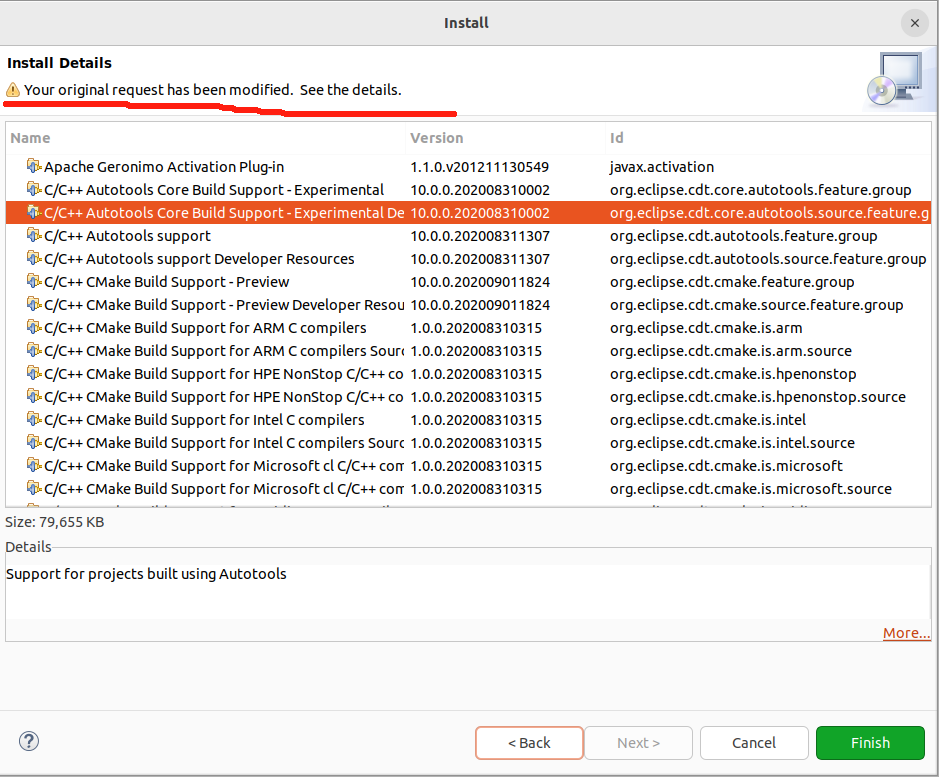
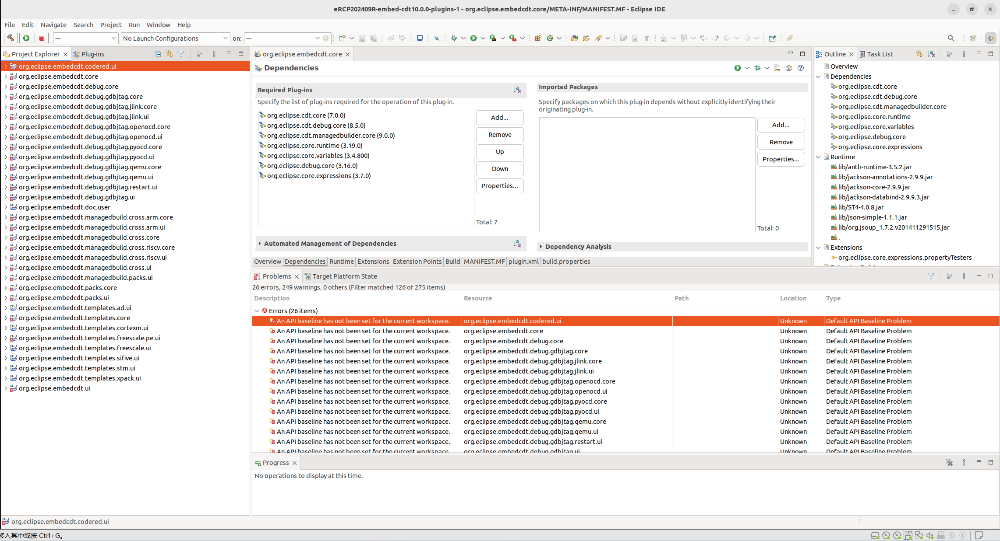
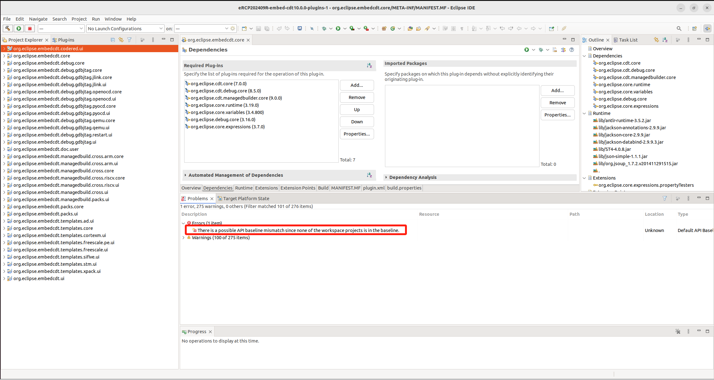
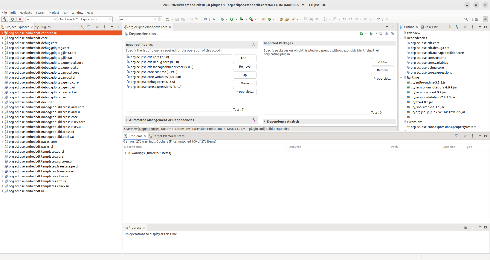
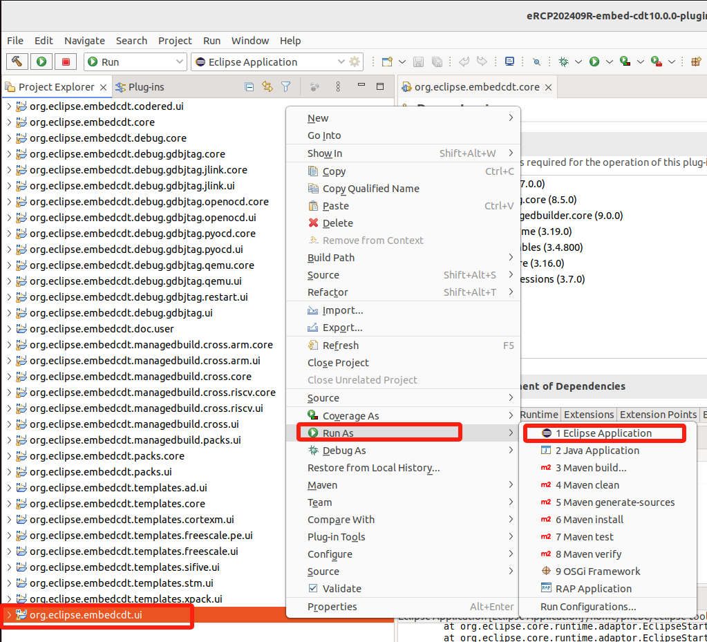
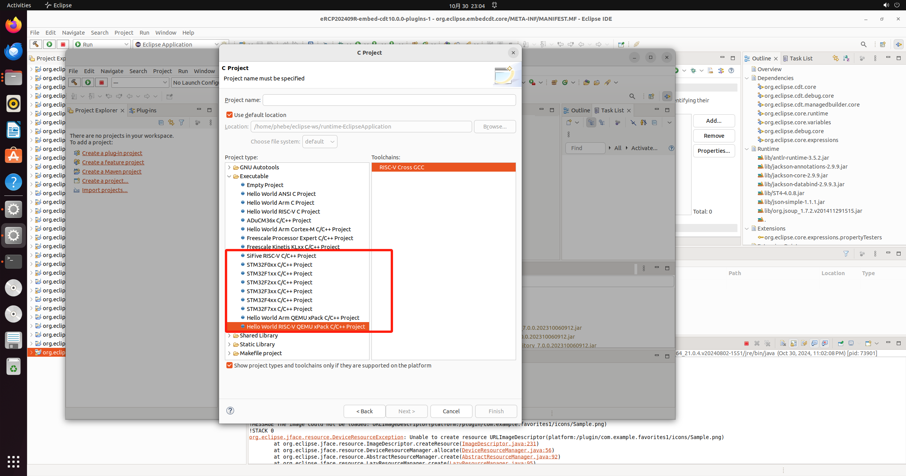
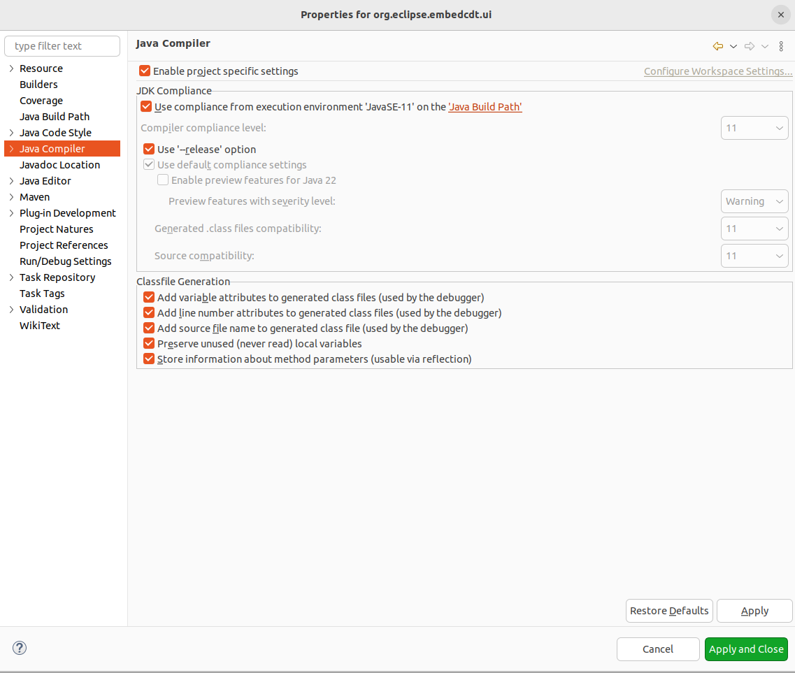

## 导入eclipse-embed-cdt工程内部插件

接上一节，通过直接阅读[源码](https://github.com/eclipse-embed-cdt/eclipse-plugins)，了解 Embeded CDT 插件的组成。发现源码仓库的 https://github.com/eclipse-embed-cdt/eclipse-plugins/tree/develop/plugins 下面有很多的插件：

- 从插件的命名上可以看出，这就是需求关联度最高的相关插件，完善或者仿照这些插件进行开发能扩展 RISC-V 开发板的支持需求。
- 从单个插件如 [org.eclipse.embedcdt.core](https://github.com/eclipse-embed-cdt/eclipse-plugins/tree/develop/plugins/org.eclipse.embedcdt.core) 目录下的文件组成可以看出（.project 文件等）这是一个独立的 Eclispe Plugin Project。因此后续的开发可以导入这些源码进行开发。

接下来就看导入 plugins 目录下的 插件工程，并理解和学习这些插件。

### 导入插件工程

1. "File"> "Import"
2. 选择 “Plug-in Development” > "Plug-ins and Fragments"
   
3. Directory 中选择 源码路径，对照图片选择相关选项
   
4. 选择添加一个或者所有工程。
   

   图片展示的是添加所有 Plugins 下的插件
   
5. 点"Finish" 完成插件导入。

   

   Eclispe中已经导入了多个插件工程。但是这里报了很多错误，需要逐一看看 Errors 信息，分析和解决这些错误。

### Errors 分析

找一个工程，点开错误信息看看：


基本上都是 XXXX cannot be resolved to a type 的错误。

结合 MANIFEST.MF 文档的错误提示，发现 Dependencies Required Plug-ins 中有三个包报错。对照一下版本信息，发现之前按照 eclipse-embed-cdt/eclipse-plugins 工程需要[导入的 CDT 9.2.1 版本](./installplugin.md)的相关插件或者Feature的版本 与 Dependencies Required Plug-ins 中有三个包报错提示的版本不一致。

此处省略N个字。。。。。。

总之CDT 也是很多插件的组合，里面有非常多的小插件（插件下面还有插件）。就是找到 CDT 的下载页面（https://github.com/eclipse-cdt/cdt/blob/main/Downloads.md），然后下载多个 CDT 版本并解压对比内在的插件包版本后发现，下面的版本与 CDT 10.0.0 中的版本一致。

```
org.eclipse.cdt.core (7.0.0) ：

org.eclipse.cdt.debug.core (8.5.0)

org.eclipse.cdt.managedbuilder.core (9.0.0)
```


### 为插件工程安装 CDT 10.0.0

> 说明：这里我重新解压了另一个 [Eclipse IDE for RCP and RAP Developers](https://www.eclipse.org/downloads/packages/release/2024-09/r/eclipse-ide-rcp-and-rap-developers)，并新开了一个工作空间。重新安装 CDT 10.0.0 插件。
>
> Tips：在不断尝试的过程中，注意可以解压多个 Eclipse IDE for RCP and RAP Developers，根据需求和验证目的创建多个 Workspace来进行操作，以保证环境的隔离。

安装 CDT 10.0.0 的过程并不顺利，我尝试了多次安装，依然不能消除 XXXX cannot be resolved to a type 的错误，经过对比发现安装到 Eclipse 根目录 Plugins下的插件版本 与 CDT 10.0.0 下的版本不一致了。（经过分析我猜测是因为Eclipse 自动调整更新了一些依赖包的版本）。

最后，我按照如下的操作消除了依赖错误：

1. 请务必在安装 CDT 之前先导入插件工程。
2. 导入所有插件工程后，再安装 CDT 10.0.0 插件。

   1. 找到 CDT 10.0.0 的二进制包，或者 P2 repo link：https://archive.eclipse.org/tools/cdt/releases/10.0/cdt-10.0.0/

   > 请指定到10.0/cdt-10.0.0/ ，直接使用 https://archive.eclipse.org/tools/cdt/releases/10.0/  会默认使用新一点的版本，10.0.1 有一个包版本和依赖要求不一致。（完全一致的是10.0.0版本）
   >

   

   2. 输入CDT 10.0.0  P2 repo link： https://archive.eclipse.org/tools/cdt/releases/10.0/cdt-10.0.0/  安装 CDT 10.0.0 插件：
      **注意：链接地址填对，然后下方的复选框也修改了默认值，参考上图勾选。**
      
      
      

      后面按照界面向导下一步，在弹出信任窗口的时候，全选 > 信任。（仔细看很多包的版本是11.6.x，但是cdt主要的还是10.0）

      最后安装完成后会提示重启 Eclipse。
   3. Eclipse 重启后，XXXX cannot be resolved to a type 这种错误全部消除；至少说明 CDT 安装成功。

      

### API baseline Errors

执行到上面一步，每个工程都剩下一个错误： An API baseline has not been set for the current workspace.

按照 [API baseline](https://help.eclipse.org/latest/index.jsp?topic=%2Forg.eclipse.pde.doc.user%2Ftasks%2Fapi_tooling_baseline.htm) 的 [设置操作方法](https://help.eclipse.org/latest/index.jsp?topic=%2Forg.eclipse.pde.doc.user%2Ftasks%2Fapi_tooling_baseline.htm) 执行：**Windows** -> **Preferences** -> **Plug-in Development** -> **API Baselines** -> **Add Baselines**

Location：API 基线的位置是 Eclipse SDK 安装的路径，通常是安装的“ *plugins* ”文件夹的路径。


这里设置为当前的eclipse根目录下的plugin（eclipse 202409R+cdt 10.0.0）；

值得高兴的是，所有的包依赖错误都没有了。但是还有一个错误：There is a possible API baseline mismatch since none of the workspace projects is in the baseline.



### API baseline mismatch

API baseline mismatch 的问题暂时没有找到解决方法，问题是什么版本才是 match？

我尝试过：

1. 设置多个 Eclipse 根目录下的 plugins目录；
2. 下载的 不同版本的 CDT 的 plugins目录（9.2.1 、10.0.0）；
3. Project > clean 操作；

错误依然不变。

[这里](https://stackoverflow.com/questions/29473967/eclipse-gives-an-api-baseline-has-not-been-set-for-the-current-work-space-er)有人忽略基线的错误：

**Windows** -> **Preferences** -> **Plug-in Development** -> **API Baselines**

Under **Options** find **Missing API baseline** -> If **Error** is selected change it to **Warning** or **Ignore** ->  **Apply** .




放弃解决dismatch的问题了，先跳过这个错误看是否能够正常运行使用。设置后 Eclipse 不再报错，接下来找一个插件运行下是否能运行：





插件运行正常，说明暂时不影响功能。先跳过这个问题，带着问题向后看看。

成功的操作环境备忘：

- eclipse：/home/phebe/eclipse-tools/eRCP202409R-CDT10.0.0-one/eclipse
- ws：eRCP202409R-embed-cdt10.0.0-plugins-1

### 总结

1. eclipese版本：[Eclipse IDE for RCP and RAP Developers](https://www.eclipse.org/downloads/packages/release/2024-09/r/eclipse-ide-rcp-and-rap-developers)  202409R

   > 后续发现每年的 6 月的版本会review，相对来说 6 月版本可能是一个更加稳定的版本。
   >
2. eclipse安装的cdt插件版本：

   1. https://github.com/eclipse-embed-cdt/eclipse-plugins  ：maven工程，其导入和构建不需要安装cdt插件，README要求的 cdt 9.2.1 大概是指插件所需的cdt版本，但是经过验证当前的v6.6.1 需要 cdt 10.0.0
   2. https://github.com/eclipse-embed-cdt/eclipse-plugins/tree/master/plugins 目录下的若干个插件工程/包： cdt 10.0.0
3. 关于 Java 环境：Eclipse 自身运行所需的JVM环境，与 Eclipse 中的 project JVM 运行环境是不同的。也是分开指定的。

   - Eclipse本身：Eclipse 自身的运行所需要的JVM已经集成到Eclipse安装程序中，用户无需提前安装。具体见安装目录下eclipse.ini 的文件中的 -vm 参数。
     
   - [eclipse-embed-cdt](https://github.com/eclipse-embed-cdt/eclipse-plugins) 工程：这是一个Maven工程，根据仓库README文档中的环境描述信息。要求是 JavaSE-11 or later;
     构建的时候，需要选择指定openjdk 11这个正确的版本，否则构建会报错。

     
   - [eclipse-embed-cdt/plugins](https://github.com/eclipse-embed-cdt/eclipse-plugins/tree/master/plugins) 下的插件工程诸如 org.eclipse.embedcdt.ui：关注MAINFEST.MF的 Bundle-RequiredExecutionEnvironment 等描述信息，这里要求是 JavaSE-11；
     看项目属性：在导入后默认情况下，是 java 11；
     

### 疑问

在操作过程中，还有一些操作、或者原理没有搞清楚的或者不确定的，这里备忘，后面带着问题继续。

1. 通过 Eclipse Markerplace 安装插件，没找到如何选择非最新版本。怎么看都只能安装最新版本插件。
2. 通过 Install New Software 安装插件，选择下载到本地的cdt 10.0.0版本（其它版本同），似乎无效，都会自动更新很多软件包版本（通过对比，安装过程中的部分包信息版本比下载的高）；使用p2网址，也存在同样的问题。似乎都绕不过“Your original request has been modified. see the details”，会调整插件版本，这个是谁在控制，依赖关系的控制是谁？

   
3. API baseline：理论上应该是eclipse根下的plugins目录；但是换成cdt 10.0.0 也同样报mismatch。API baseline如何设置一个合理的能够让其不报错的版本？
4. 不设置 baseline ，后者跳过 API baseline mismatch 对项目又有什么影响？

### 下一步

进一步学习插件工程：

- 每个工程主要是负责做什么？
- 各工程之间的关系
- 如何开发
