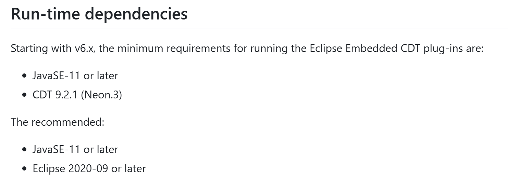
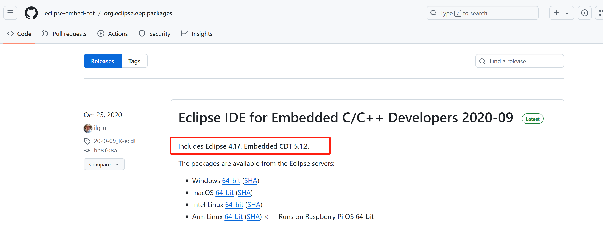
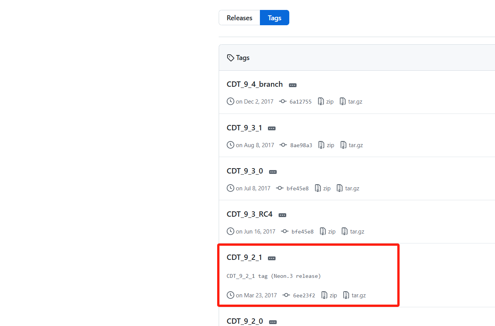
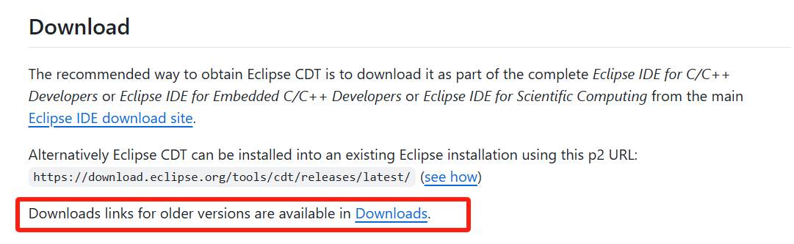
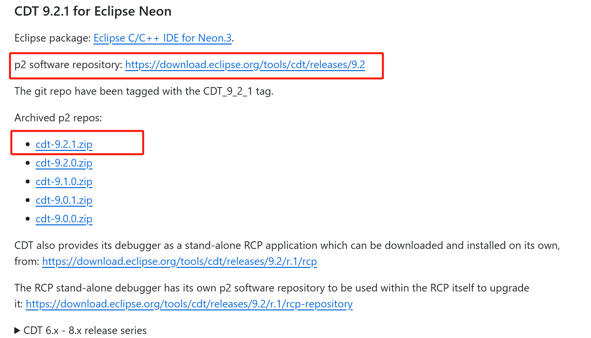
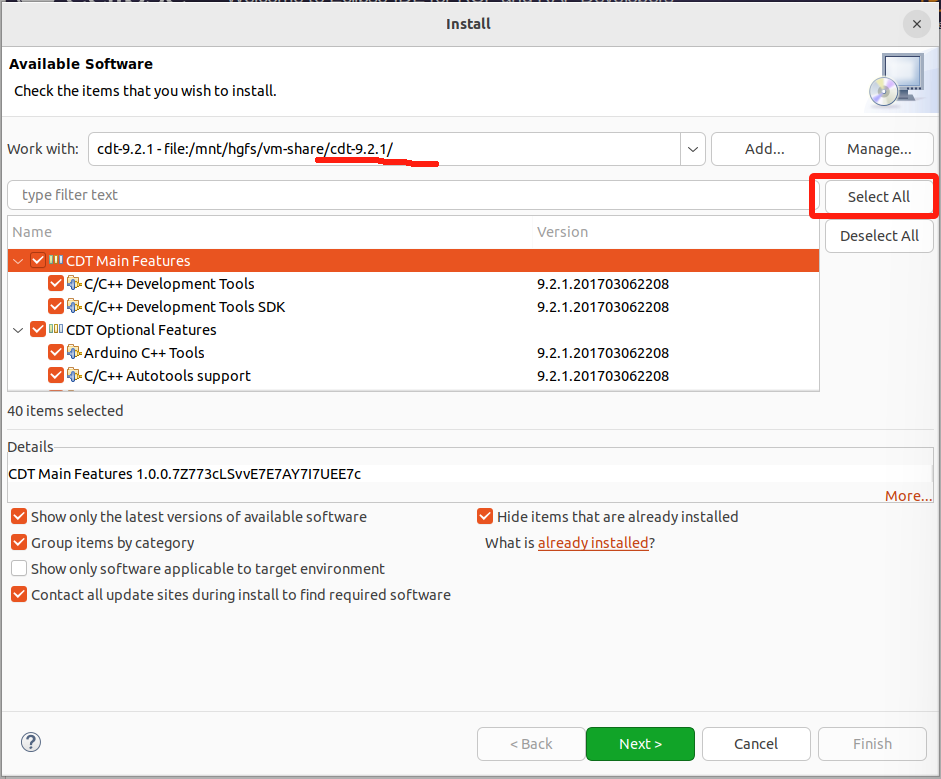
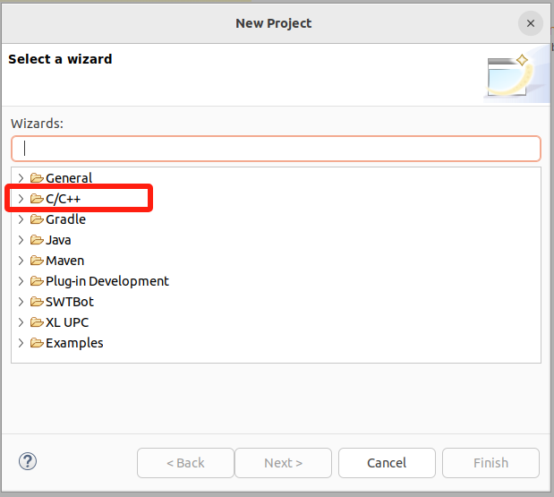
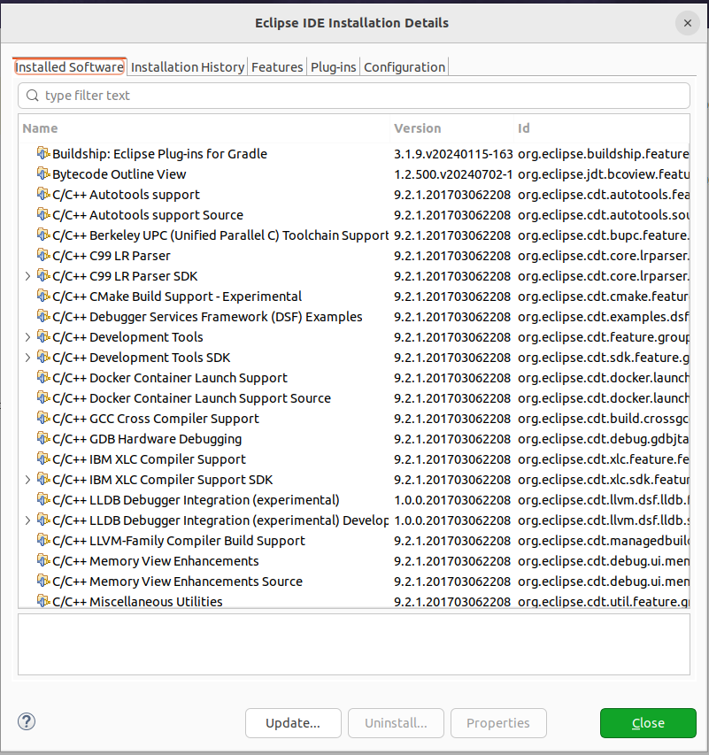

### 为开发环境导入CDT插件

> 注意：在安装 CDT 插件的时候，非常容易直接从 Eclipse MarketPlace 直接搜索安装，这种安装方式不方便控制安装的 CDT 版本，后续工程报各种错误。正确的安装方式是先仔细阅读和了解本仓库的代码对 CDT 的版本要求，按照对应的版本。

#### 先决条件

1. 在 README中我们可以找到相关描述：

#### 安装 CDT 9.2.1

安装CDT 9.2.1 版本插件。

插件的安装在之前介绍了2种方法，第一种从 Eclipse MarketPlace 直接搜索安装，暂时似乎不容易控制版本，会默认按照最新 CDT 版本。

采用第二种方法，需要找到 CDT 9.2.1 下载地址。

3. 明确说明了需要 Java 11及以上版本，CDT 9.2.1版本，Eclipse 2020-09版本及以后；

[这里](https://github.com/eclipse-embed-cdt/org.eclipse.epp.packages/releases/)只找到早古的版本的归档，近期的版本则没有；在https://github.com/eclipse-embed-cdt/eclipse-plugins 中没有找到cdt的对应版本的下载链接。

继续 github 搜索 cdt，找到 cdt 插件仓库寻找 ：https://github.com/eclipse-cdt/cdt

在release中寻找  CDT 9.2.1 (Neon.3) 版本： https://github.com/eclipse-cdt/cdt/tags?after=CDT_9_4_0

这里只提供了源码，未提供二进制。

仔细读 cdt 仓库的readme文档：

点击 上述链接：https://github.com/eclipse-cdt/cdt/blob/main/Downloads.md  ，可以下载编译后的插件。

**通过本地文件安装** :

* 如果您已经下载了插件的文件（通常是 `.zip`或 `.jar`格式），在Help—> `Install New Software...` 界面中，点击 `Add...` 按钮，选择解压后的cdt根目录（不用选择某个jar文件）。
* 选择 `Archive...`，然后导航到您下载的插件文件。或者输入 p2 software repository 地址 : https://download.eclipse.org/tools/cdt/releases/9.2
* 添加完插件后，按照提示完成安装过程。

注意，整个安装过程可能持续十几分钟，安装完成后会提示重新启动eclipse。

#### 安装后验证

重启eclipse后，我们首先可以看到 Eclipse 支持 C/C++工程的创建了，还有也能查到 CDT插件安装成功了；此外之前导入的工程的 Error 已经解决了。

