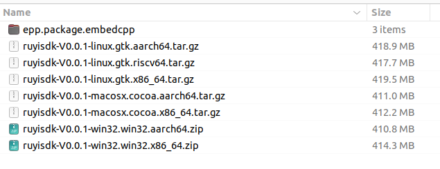

## Eclipse IDE 打包

为了让用户能够方便的安装和使用 Eclipse IDE，Eclipse提供了打包工程来完成打包工作。

目前关于Eclipse IDE打包的相关工程，我找到了两个：

- ① https://github.com/eclipse-platform/eclipse.platform.releng.aggregator
- ② https://github.com/eclipse-packaging/packages

`eclipse.platform.releng.aggregator` 和 `eclipse-packaging/packages` 是两个不同的项目，它们在构建 Eclipse IDE 方面有不同的目标和用途。以下是这两个项目的区别：

### eclipse.platform.releng.aggregator

1. **项目目标** ：

* 该项目主要用于构建 Eclipse SDK，提供 Eclipse 基于应用的框架、Java 开发工具和插件开发工具。
* 它包含了构建 Eclipse 平台所需的资源和脚本，是 Eclipse 项目团队（包括平台、JDT、PDE、Equinox）发布工程服务的基础。

2. **构建内容** ：

* 主要用于构建和发布 Eclipse SDK，包括各种开发工具和框架。
* 包含了从源代码到最终下载包的整个构建过程，使用 Maven 进行构建。

3. **使用场景** ：

* 适用于需要自定义和构建整个 Eclipse SDK 的用户，提供了详细的构建脚本和指导。

### eclipse-packaging/packages

1. **项目目标** ：

* 该项目旨在创建基于定义好的配置文件（profiles）的入门级下载包。
* 它定义并创建了各种 Eclipse 版本的下载包，如 Java 开发者、Java 企业开发者、C/C++ 开发者等。

2. **构建内容** ：

* 主要关注于打包和分发预定义的 Eclipse 版本，这些版本针对不同的开发需求进行了配置。
* 提供了不同配置的 Eclipse IDE 下载包，便于用户直接使用。

3. **使用场景** ：

* 适用于需要下载并使用预配置的 Eclipse IDE 的用户，提供了多种针对不同开发需求的版本。

### 总结

> 结论基于实操感受总结，具体详见aggregator、packages的构建过程。

* **eclipse.platform.releng.aggregator** ：[eclipse.platform.releng.aggregator本地构建](./aggregator/1-localbuild.md)  ，构建输出分为 sdk.ide 和 platform.ide；

  
* **eclipse-packaging/packages** ：[eclipse-packaging/packages本地构建](./packages/1-localbuild.md) ，适用于构建EPP下载页面提供的各种不同package版本的IDE，包括但不限于 Java、PHP、C/C++等。以下图中每个目录下都能够生成图2对应的安装程序。

  

我的目的主要是想要生成 Eclipse Embedded CDT 插件的自定义衍生版本，并希望将这些修改连同 Eclipse 一起生成一个名为 `ruyisdk ide` 的 Eclipse 二进制安装包。在这种情况下，基于 `eclipse-packaging/packages` 源码进行定制化修改和构建更佳。

## 自定义 IDE 打包构建

- 第一步：GUI定制化
  - 参考 [自定义IDE GUI修改需求](./packages/2-guiRequires.md) 需求，按照 [自定义IDE GUI配置修改说明](./packages/3-guimodify.md) 的配置修改项进行定制化修改，并重新构建。
  - 验证：对构建结果进行安装验证，GUI主要的修改项对照需求均完成。详见 [ruyisdkidev0.0.1启动加载效果](./image/ruyisdkidev0.0.1.gif)
  - 代码：https://github.com/xijing21/packages/tree/ruyiide

- [todo]第二步：插件的更新和集成到pacages中构建打包
  - 如何替换升级后的插件（并保障插件兼容性）