## 本地构建eclipse.platform.releng.aggregator

### 更新或者下载最新Tag（能成功构建的最新代码）

#### 验证riscv64是否支持（需要支持rv64的版本）

因为2024-09-29： https://riscv.org/blog-chinese/2024/09/eclipse-riscv64-support-upstreamed/

去commit中检查该事件是否涉及到本仓库的更新：https://github.com/eclipse-platform/eclipse.platform.releng.aggregator/commits/master/

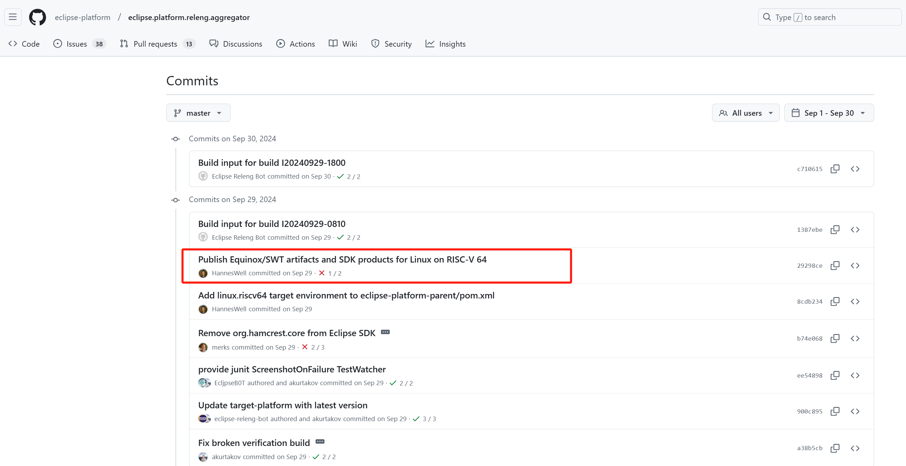

#### 选择一个版本

Eclipse Project Build Types（P,M,I,S, and R）：https://download.eclipse.org/eclipse/downloads/build_types.html

I-build：EST/EDT 每天下午6点 - 8点   Eclipse Platform 4.3X I-build     Eclipse (Platform, JDT, PDE and Equinox) Release Engineering Build

Eclipse Platform 4.34 Endgame Build

Eclipse Platform 4.34 RC1 promotion

参考：https://eclipse.dev/eclipse/platform-releng/buildSchedule.html

> **f19c9f98dd5d2871ba19dc7fdc8e17cdc48d2ebd**
>
> https://github.com/eclipse-platform/eclipse.platform.releng.aggregator/archive/refs/tags/I20241203-1800.tar.gz

#### 验证构建

https://wiki.eclipse.org/Platform-releng/Platform_Build

基于 f19c9f98dd5d2871ba19dc7fdc8e17cdc48d2ebd 源码进行构建。 **后续若无特殊说明，均基于这个版本。**

1. 设置环境变量：

   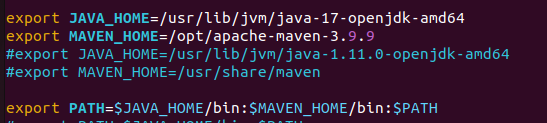

   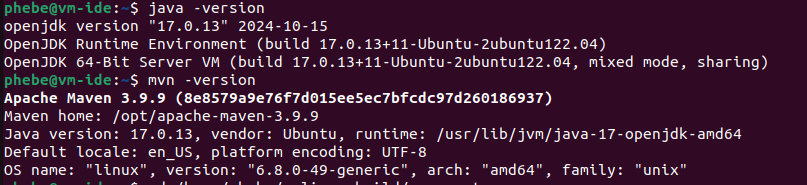

   ```
   export MAVEN_OPTS=-Xmx2048m 
   export JAVA_HOME=/usr/lib/jvm/java-17-openjdk-amd64
   export MAVEN_HOME=/opt/apache-maven-3.9.9
   #export JAVA_HOME=/usr/lib/jvm/java-1.11.0-openjdk-amd64
   #export MAVEN_HOME=/usr/share/maven

   export PATH=$JAVA_HOME/bin:$MAVEN_HOME/bin:$PATH

   ```
2. 构建过程参考文档：

   ```
   ~/eclipse-build$ mkdir aggregator
   ~/eclipse-build$ cd aggregator/
   #/home/phebe/eclipse-build/aggregator/

   git clone https://github.com/eclipse-platform/eclipse.platform.releng.aggregator.git
   cd eclipse.platform.releng.aggregator

   #git reset --hard f19c9f98dd5d2871ba19dc7fdc8e17cdc48d2ebd
   #b2d6bdda0d3f7fbf8110e21ad52236db78eddc33   #12月10日 I20241209-1800

   git submodule update --init --recursive
   Cloning into '/home/phebe/eclipse-build/aggregator/eclipse.platform.releng.aggregator/eclipse.jdt.core'...
   Cloning into '/home/phebe/eclipse-build/aggregator/eclipse.platform.releng.aggregator/eclipse.jdt.core.binaries'...
   Cloning into '/home/phebe/eclipse-build/aggregator/eclipse.platform.releng.aggregator/eclipse.jdt.debug'...
   Cloning into '/home/phebe/eclipse-build/aggregator/eclipse.platform.releng.aggregator/eclipse.jdt.ui'...
   Cloning into '/home/phebe/eclipse-build/aggregator/eclipse.platform.releng.aggregator/eclipse.pde'...
   Cloning into '/home/phebe/eclipse-build/aggregator/eclipse.platform.releng.aggregator/eclipse.platform'...
   Cloning into '/home/phebe/eclipse-build/aggregator/eclipse.platform.releng.aggregator/eclipse.platform.swt'...
   Cloning into '/home/phebe/eclipse-build/aggregator/eclipse.platform.releng.aggregator/eclipse.platform.ui'...
   Cloning into '/home/phebe/eclipse-build/aggregator/eclipse.platform.releng.aggregator/equinox'...
   Cloning into '/home/phebe/eclipse-build/aggregator/eclipse.platform.releng.aggregator/equinox.binaries'...
   Cloning into '/home/phebe/eclipse-build/aggregator/eclipse.platform.releng.aggregator/equinox.p2'...
   Submodule path 'eclipse.jdt': checked out 'ec750abd6e1e1ae1726bdc11bc2c3cd3b21aac1c'
   Submodule path 'eclipse.jdt.core': checked out '40ddacf26d187e663a69c2937640da8d94888b48'
   Submodule path 'eclipse.jdt.core.binaries': checked out '8246573c22e3f9604c06829318151dfa16a04c70'
   Submodule path 'eclipse.jdt.debug': checked out 'a9a5f80fbccf0d7571af7b6290e572afb329392f'
   Submodule path 'eclipse.jdt.ui': checked out 'e57bf66391a325ef663aaf2762f1af6c6559e221'
   Submodule path 'eclipse.pde': checked out 'bb04e28f79f2eb22d3571de334a70b7a89b7f65f'
   Submodule path 'eclipse.platform': checked out 'e987000b2c92101529a7b00ec8d1b255dff890bb'
   Submodule path 'eclipse.platform.swt': checked out '2ce8542b0de0646ae186ada00f9623965690cacc'
   Submodule path 'eclipse.platform.ui': checked out '98ff2aa8d6b8487c882e3e24fd73ce80284ecc53'
   Submodule path 'equinox': checked out 'caf78f765569256664eec47b3fd9d28e67e17730'
   Submodule path 'equinox.binaries': checked out '6ce61379c68ee77faab69518173d70ce49bbf629'
   Submodule path 'equinox.p2': checked out '1a42e028b58e4a288852d1c1f511b3e5ac37840a'

   # https://github.com/eclipse-platform/eclipse.platform.releng.aggregator/tree/f19c9f98dd5d2871ba19dc7fdc8e17cdc48d2ebd  人工核对子模块版本也是对应的


   # clean up "dirt" from previous build see Bug 420078
   git submodule foreach git clean -f -d -x
   git submodule foreach git reset --hard HEAD
   git clean -f -d -x
   git reset --hard HEAD


   # run the build
   mvn clean verify  -DskipTests=true

   # find the results in
   # eclipse.platform.releng.tychoeclipsebuilder/eclipse.platform.repository/target/products
   ```

   一次性构建成功：
   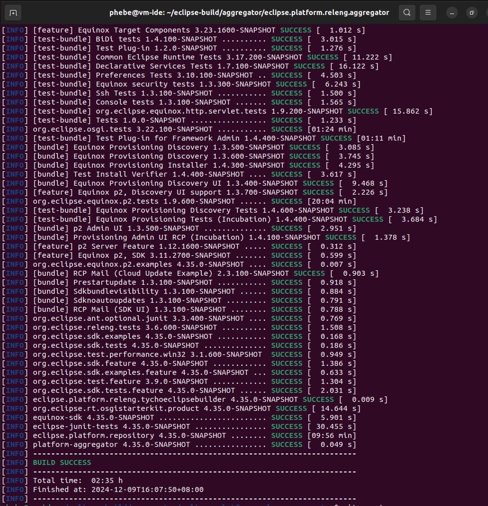

  构建输出：
  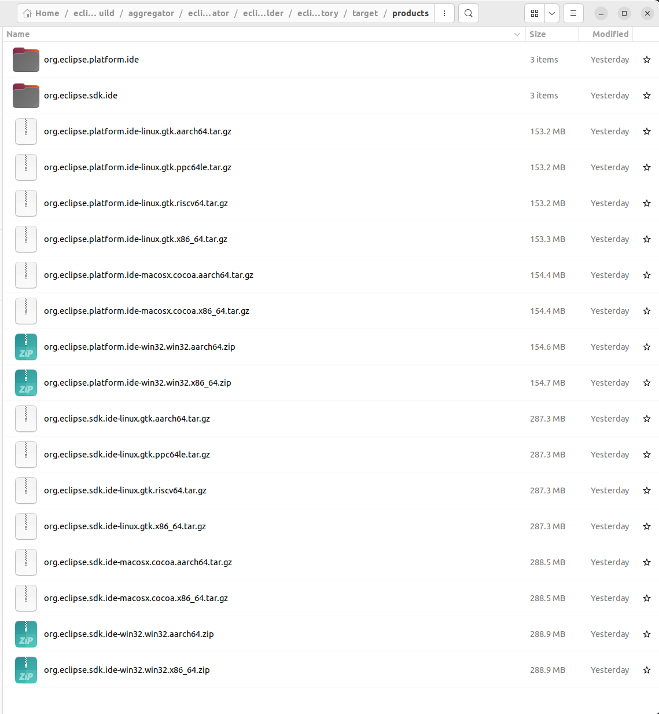
  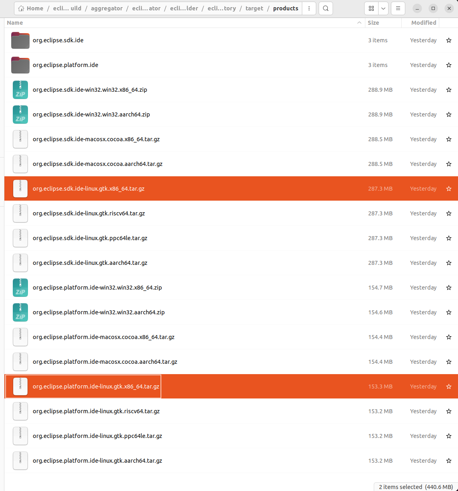

- org.eclipse.sdk.ide vs org.eclipse.platform.ide 区别，安装哪个？

  > `org.eclipse.sdk.ide` 和 `org.eclipse.platform.ide` 是Eclipse IDE的两个不同的软件包，它们之间的主要区别在于它们提供的功能和目标用户群体。
  >
  > 1. `org.eclipse.platform.ide`：
  >    * 这通常指的是Eclipse IDE for Eclipse Committers，它是一个完整的Eclipse IDE环境，包含了基本的Eclipse平台和用于开发Eclipse插件和插件的工具。
  >    * 它为希望为Eclipse平台本身贡献代码的开发者提供了必要的工具和运行时环境。
  >    * 这个软件包包含了Eclipse平台、插件开发环境（PDE）、Git和Mylyn等工具。
  > 2. `org.eclipse.sdk.ide`：
  >    * 这是Eclipse SDK（Software Development Kit），它包括了 `org.eclipse.platform.ide`中的所有内容，并增加了Eclipse插件开发所需的额外工具和源代码。
  >    * SDK是用于开发Eclipse插件的首选环境，因为它提供了完整的源代码和用于调试Eclipse平台本身的工具。
  >    * 如果你计划开发Eclipse插件或者需要更深入地了解Eclipse平台的工作原理，那么你应该安装SDK。
  >
  > 根据你的需求，以下是一些建议：
  >
  > * 如果你只是想使用Eclipse作为一个通用的Java开发环境，那么安装 `org.eclipse.platform.ide`可能就足够了。
  > * 如果你是一名插件开发者或者需要对Eclipse平台进行调试和深入理解，那么你应该安装 `org.eclipse.sdk.ide`。
  >
  > 总之，`org.eclipse.sdk.ide` 包含了 `org.eclipse.platform.ide` ，所以我优先考虑sdk版本；
  >

#### 运行自构建的ide

从 eclipse.platform.releng.tychoeclipsebuilder/eclipse.platform.repository/target/products  中找到与本地环境匹配的 ide 包，我这边选择的是

`org.eclipse.sdk.ide-linux.gtk.x86_64.tar.gz`  ，解压缩运行即可。

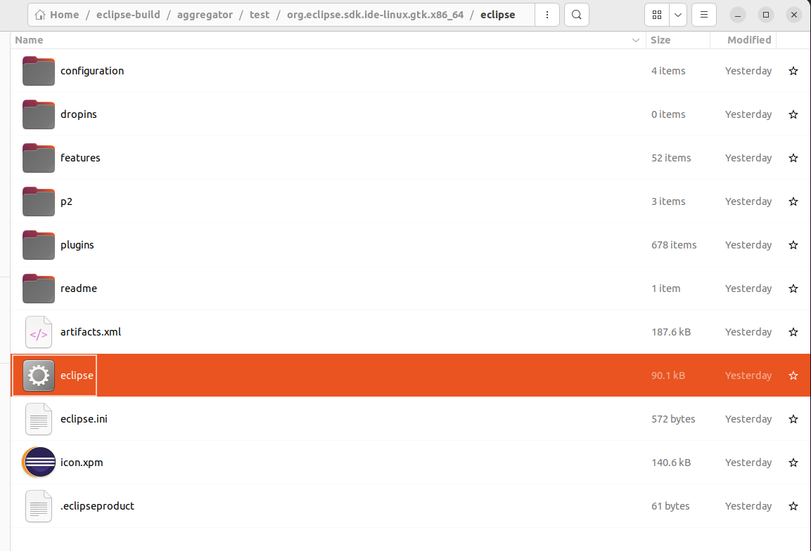

运行eclipse后，弹框：

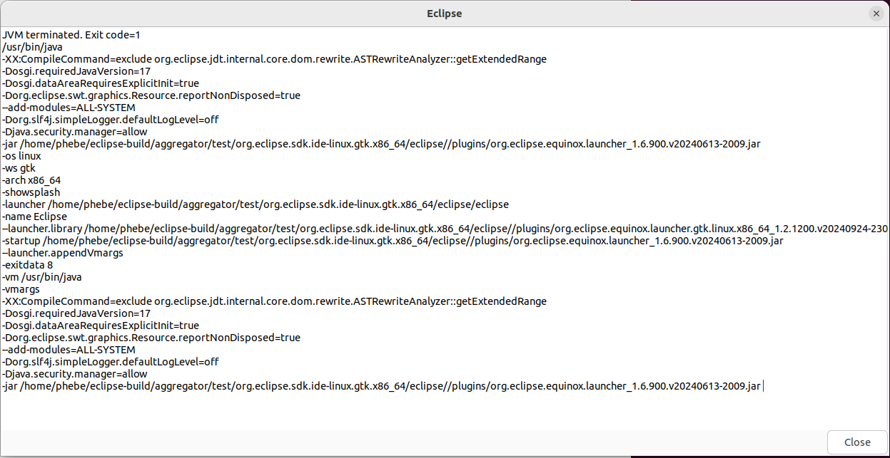

不能正常进入eclipse ide主界面。考虑是java版本不兼容问题。
上述的vm是环境变量中的java（java 17.0.13），之前了解到 eclipse 24-09R 需要 java 21及以上版本；检查并修改eclipse.ini 文件中的 vm 值：
文档中未定义vm参数，在 -vmargs之前增加：

```
-vm
plugins/org.eclipse.justj.openjdk.hotspot.jre.full.linux.x86_64_21.0.4.v20240802-1551/jre/bin/java
```

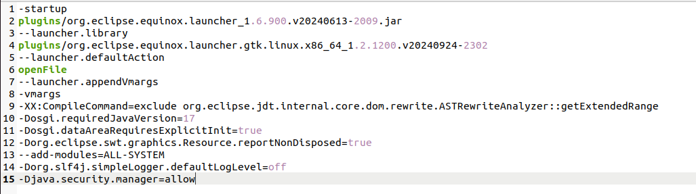

增加vm后再次运行，报错：

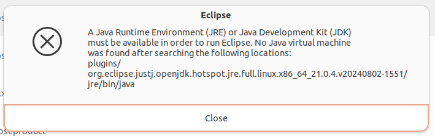

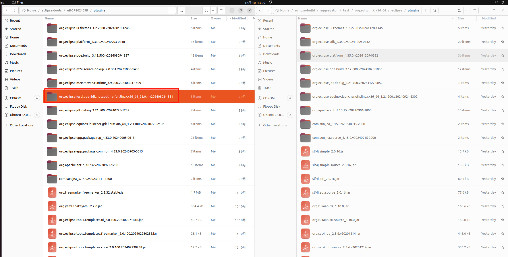

看来构建的时候应该有个 jvm 相关的参数需要设置；

```
# compile local version
mvn clean install -f eclipse.jdt.core/org.eclipse.jdt.core.compiler.batch -DlocalEcjVersion=99.99

# run build with local compiler
mvn clean verify  -DskipTests=true -Dcbi-ecj-version=99.99
```

> Maven 命令中的 `-Dcbi-ecj-version=99.99` 参数不是指 ECJ（Eclipse Compiler for Java）的实际版本号，而是一个占位符，用于指示您希望使用编译器的本地自定义版本。`99.99` 值是任意的，与 ECJ 的任何实际版本都不对应。

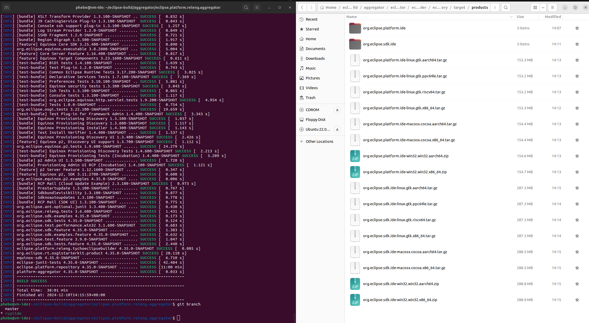

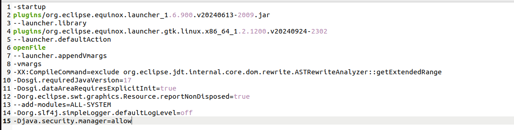

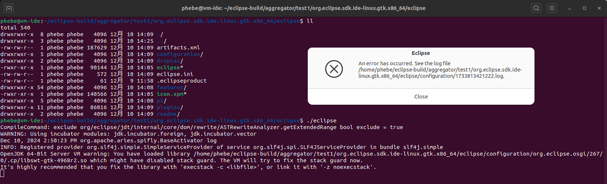

```
./eclipse 
CompileCommand: exclude org/eclipse/jdt/internal/core/dom/rewrite/ASTRewriteAnalyzer.getExtendedRange bool exclude = true
WARNING: Using incubator modules: jdk.incubator.foreign, jdk.incubator.vector
Dec 10, 2024 2:50:23 PM org.apache.aries.spifly.BaseActivator log
INFO: Registered provider org.slf4j.simple.SimpleServiceProvider of service org.slf4j.spi.SLF4JServiceProvider in bundle slf4j.simple
OpenJDK 64-Bit Server VM warning: You have loaded library /home/phebe/eclipse-build/aggregator/test1/org.eclipse.sdk.ide-linux.gtk.x86_64/eclipse/configuration/org.eclipse.osgi/267/0/.cp/libswt-gtk-4968r2.so which might have disabled stack guard. The VM will try to fix the stack guard now.
It's highly recommended that you fix the library with 'execstack -c <libfile>', or link it with '-z noexecstack'.

```

日志：

```
!SESSION 2024-12-10 14:50:20.917 -----------------------------------------------
eclipse.buildId=4.35.0.I20241210-0537
java.version=17.0.13
java.vendor=Ubuntu
BootLoader constants: OS=linux, ARCH=x86_64, WS=gtk, NL=en_US
Command-line arguments:  -os linux -ws gtk -arch x86_64

!ENTRY org.eclipse.osgi 4 0 2024-12-10 14:50:25.823
!MESSAGE Application error
!STACK 1
java.lang.UnsatisfiedLinkError: Could not load SWT library. Reasons: 
	/home/phebe/eclipse-build/aggregator/test1/org.eclipse.sdk.ide-linux.gtk.x86_64/eclipse/configuration/org.eclipse.osgi/267/0/.cp/libswt-gtk-4968r2.so: /home/phebe/eclipse-build/aggregator/test1/org.eclipse.sdk.ide-linux.gtk.x86_64/eclipse/configuration/org.eclipse.osgi/267/0/.cp/libswt-gtk-4968r2.so: invalid ELF header
	no swt-gtk in java.library.path: /usr/java/packages/lib:/usr/lib/x86_64-linux-gnu/jni:/lib/x86_64-linux-gnu:/usr/lib/x86_64-linux-gnu:/usr/lib/jni:/lib:/usr/lib
	no swt in java.library.path: /usr/java/packages/lib:/usr/lib/x86_64-linux-gnu/jni:/lib/x86_64-linux-gnu:/usr/lib/x86_64-linux-gnu:/usr/lib/jni:/lib:/usr/lib
	Can't load library: /home/phebe/.swt/lib/linux/x86_64/libswt-gtk-4968r2.so
	Can't load library: /home/phebe/.swt/lib/linux/x86_64/libswt-gtk.so
	Can't load library: /home/phebe/.swt/lib/linux/x86_64/libswt.so
	/home/phebe/.swt/lib/linux/x86_64/libswt-gtk-4968r2.so: /home/phebe/.swt/lib/linux/x86_64/libswt-gtk-4968r2.so: invalid ELF header

	at org.eclipse.swt.internal.Library.loadLibrary(Library.java:345)
	at org.eclipse.swt.internal.Library.loadLibrary(Library.java:254)
	at org.eclipse.swt.internal.C.<clinit>(C.java:19)
	at org.eclipse.swt.internal.Converter.wcsToMbcs(Converter.java:209)
	at org.eclipse.swt.internal.Converter.wcsToMbcs(Converter.java:155)
	at org.eclipse.swt.widgets.Display.<clinit>(Display.java:170)
	at org.eclipse.ui.internal.Workbench.createDisplay(Workbench.java:754)
	at org.eclipse.ui.PlatformUI.createDisplay(PlatformUI.java:185)
	at org.eclipse.ui.internal.ide.application.IDEApplication.createDisplay(IDEApplication.java:208)
	at org.eclipse.ui.internal.ide.application.IDEApplication.start(IDEApplication.java:151)
	at org.eclipse.equinox.internal.app.EclipseAppHandle.run(EclipseAppHandle.java:208)
	at org.eclipse.core.runtime.internal.adaptor.EclipseAppLauncher.runApplication(EclipseAppLauncher.java:143)
	at org.eclipse.core.runtime.internal.adaptor.EclipseAppLauncher.start(EclipseAppLauncher.java:109)
	at org.eclipse.core.runtime.adaptor.EclipseStarter.run(EclipseStarter.java:439)
	at org.eclipse.core.runtime.adaptor.EclipseStarter.run(EclipseStarter.java:271)
	at java.base/jdk.internal.reflect.NativeMethodAccessorImpl.invoke0(Native Method)
	at java.base/jdk.internal.reflect.NativeMethodAccessorImpl.invoke(NativeMethodAccessorImpl.java:77)
	at java.base/jdk.internal.reflect.DelegatingMethodAccessorImpl.invoke(DelegatingMethodAccessorImpl.java:43)
	at java.base/java.lang.reflect.Method.invoke(Method.java:569)
	at org.eclipse.equinox.launcher.Main.invokeFramework(Main.java:668)
	at org.eclipse.equinox.launcher.Main.basicRun(Main.java:605)
	at org.eclipse.equinox.launcher.Main.run(Main.java:1481)
	at org.eclipse.equinox.launcher.Main.main(Main.java:1454)
```

结论：自构建成功，但是运行时启动失败；

从官网每日构建下载的包（4.34和近期构建的都无法正常启动）

换openjdk21再次尝试依然失败；

而且通过代码初步了解，未看到cdt或者embedded cdt等相关构建；对照 packaging/packages 工程，packages 仓库更加合适，换packages尝试。

### 代码分析

> 图片有的是基于master分支截取的，未更新，请忽略。

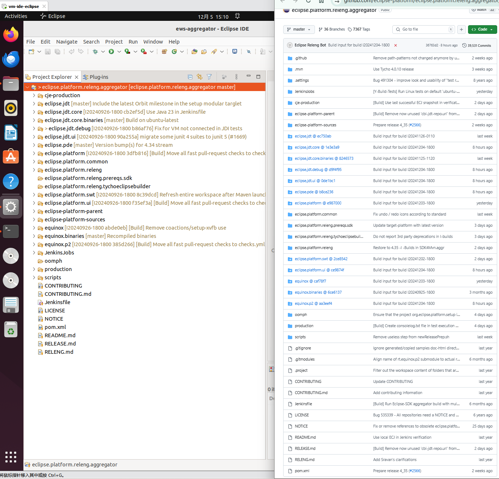

思路：
根据目录或者文件名，跟着感觉挨个看。

- cje-production

  - readme.txt
  - **Y-build**
  - cje-production/scripts/publish.xml

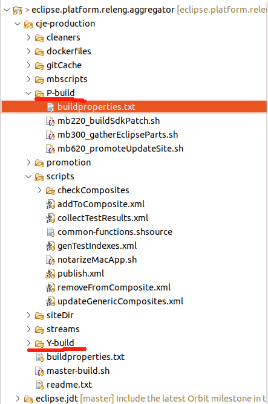

#### cje-production

cje-production- > 这是我们将为 Cloudbees Jenkins Enterprise 开发生产脚本的位置。

> 以下是一些基本规则：
>
> 1. 每个脚本以 mb_.sh 开头。xxx 是一个三位数。
>
> * 000 - 099 - 准备构建环境，如设置环境变量等。
> * 100 - 199 - 克隆存储库并使用正确的分支 / 标签进行准备，并进行标记（Git 操作）。
> * 200 - 299 - Maven 操作（使用清单中的版本更新 pom，创建 tar 包，构建 SDK / 补丁等）。
> * 300 - 399 - 收集部件（将不同的构件收集到临时构建位置）。
> * 400 - 499 - 将 Eclipse、存储库和 Equinox 构件复制到相应的临时下载位置，并生成必要的网页。
> * 500 - 599 - 生成构建报告（运行 p2.repo.analyzers 和 dirt 报告、jdeps 报告等）。
> * 600 - 699 - 将构建推广到 [download.eclipse.org](https://download.eclipse.org/)。
> * 700 - 799 - 触发测试并发送邮件。
>
> 2. 每个脚本都应接受 $ENV_FILE。这个环境文件是在准备构建环境阶段创建的。
> 3. 每个脚本都应引用 “common-functions.shsource”。这将包含在脚本中使用的通用方法。
>
> 文件夹结构：
> 根目录（cje-production）：
> readme.txt
> mbscripts
> common
> master-build.sh
> siteDir（用于保存网站的临时位置）。

#### 什么叫 P-build，什么叫 Y-build？有啥区别？

在软件开发中，特别是在开源项目中，通常会使用以下术语来描述不同类型的构建：

1. **P-build（Patch Build）** ：

* 这通常指的是一个小的、局部的构建，它包含了针对特定问题的修复或补丁。P-build通常用于解决紧急的bug修复或者小范围的改进，而不需要完整地构建整个项目。

1. **Y-build（Yearly Build 或者 Major Build）** ：

* 这通常指的是更大规模、可能包含重大更新或新功能的构建。Y-build可能代表一个主要的版本更新，通常会在一年的某个时间点发布，包含了一系列的新特性和改进。

需要注意的是，这些术语在不同的组织和项目中可能有不同的含义。如果您想要了解Eclipse项目中的具体定义，建议查看他们的官方文档或联系项目维护者获取更准确的信息。

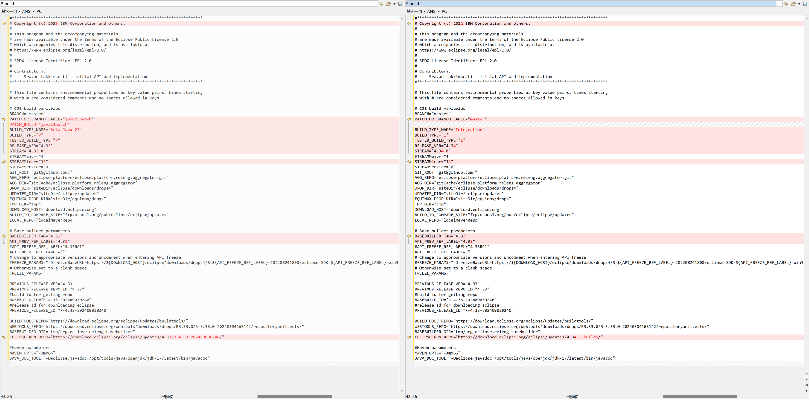

### 如何修改版本？

grep -rn "cbi-ecj-version" .
./eclipse.jdt.debug/org.eclipse.jdt.launching/pom.xml:47:                `<version>`${cbi-ecj-version}`</version>`
./eclipse.jdt.core/.github/workflows/ci.yml:46:        mvn -U clean verify --batch-mode --fail-at-end -Ptest-on-javase-21 -Pbree-libs -Papi-check -Djava.io.tmpdir=$WORKSPACE/tmp -Dproject.build.sourceEncoding=UTF-8 -Dtycho.surefire.argLine="--add-modules ALL-SYSTEM -Dcompliance=1.8,11,17,20 -Djdt.performance.asserts=disabled" -Dcbi-ecj-version=99.99

./eclipse.jdt.core/Jenkinsfile:42:						-Dcbi-ecj-version=99.99

./cje-production/mbscripts/mb220_buildSdkPatch.sh:47:  -Dcbi-ecj-version=99.99
./RELEASE.md:70:       * Finally update the `cbi-ecj-version` in [eclipse.platform.releng.aggregator/eclipse-platform-parent/pom.xml](https://github.com/eclipse-platform/eclipse.platform.releng.aggregator/blob/master/eclipse-platform-parent/pom.xml)
./README.md:53:mvn clean verify  -DskipTests=true -Dcbi-ecj-version=99.99
./eclipse-platform-parent/pom.xml:89:    `<cbi-ecj-version>`3.39.0.v20240820-0604 `</cbi-ecj-version>`
./eclipse-platform-parent/pom.xml:444:              `<version>`${cbi-ecj-version}`</version>`
./eclipse-platform-parent/saveproperties/mavenproperties.properties:8:cbi-ecj-version=${cbi-ecj-version}
./eclipse-platform-parent/target/mavenproperties.properties:8:cbi-ecj-version=3.39.0.v20240820-0604
./Jenkinsfile:46:						-Dcbi-ecj-version=99.99 \

### 如何修改logo

### 如何修改命令

### 如何集成自构建的Embeded cdt插件

## 结论

1. 当前的eclipse.platform.releng.aggregator 不够完善，存在问题需要解决（放弃一半
2. 通过构建的输出，以及源码分析，发现与需求不太匹配
3. 因此，换packages 仓库源码尝试构建
