# eclipse-packaging packages

## 资源

- 仓库：https://github.com/eclipse-packaging/packages
- https://github.com/eclipse-packaging/packages/blob/master/RELEASING.md
- https://github.com/eclipse-packaging/packages/issues/251

## 本地构建

> **请注意：构建环境 java 需要 21+；maven 3.9.9 ok（需要兼容4.0.0模板）**；
>
> 一定要预留足够的磁盘空间，建议80G以上（23G不够用，后面扩容增加100G重构建，构建完后剩余空间只有43G， 23+100 -43 = 80G）
>
> 空间问题没有二次验证，仅仅作为些许参考；而且建议在构建的时候可以把不需要的平台和架构去掉，一方面提高构建效率，另一方面节约磁盘空间；
>
> 第一次构建为了验证代码的合格情况，全部构建；

### 本地构建记录

初始环境说明：java 是 17，maven是3.9.9  （之前的一些工程环境所需的；本仓库未明确说明java版本，因此暂时未修改）

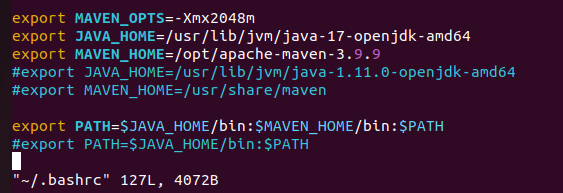

```
# clone代码
mkdir packaging  && cd packaging
git clone https://github.com/eclipse-packaging/packages.git
cd packages

# 新建一个分支，将代码回退到202412R版本对应
git checkout -b 202412R 
git branch
git reset --hard be56417bc51b8803ddf97748a78201e0421ef2f8

# 在202412R分支上构建
mvn clean verify
# 报错1
mvn -X clean verify
```

OSGi 需要21 及以上版本的openjdk，因此安装并升级本地环境的 java 版本：

```
sudo apt update
sudo apt install openjdk-21-jdk

vim ~/.bashrc
source ~/.bashrc
java -version  # 输出21是正确的

#sudo update-alternatives --config java
#sudo update-alternatives --set java /usr/lib/jvm/java-21-openjdk-amd64/bin/java

```

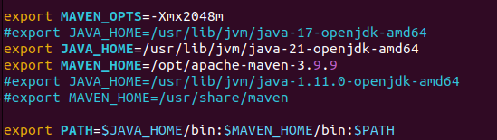

### 错误

错1：
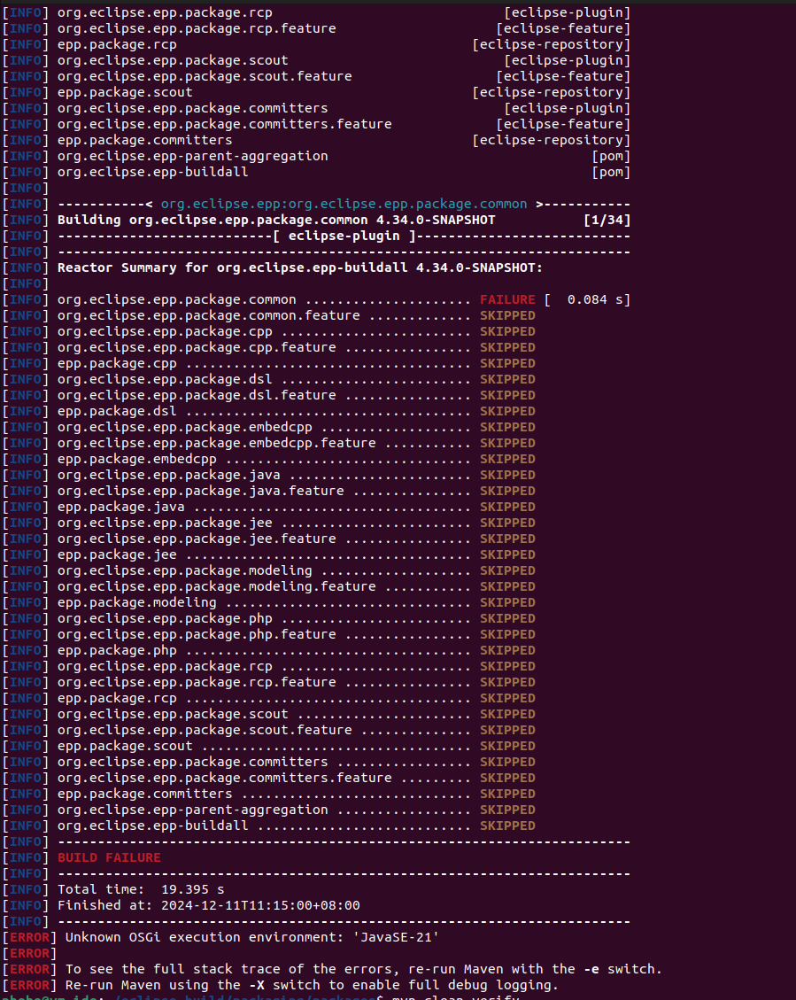

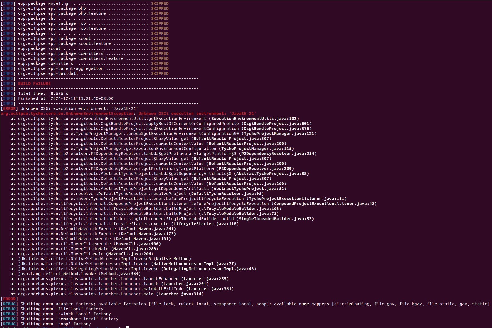

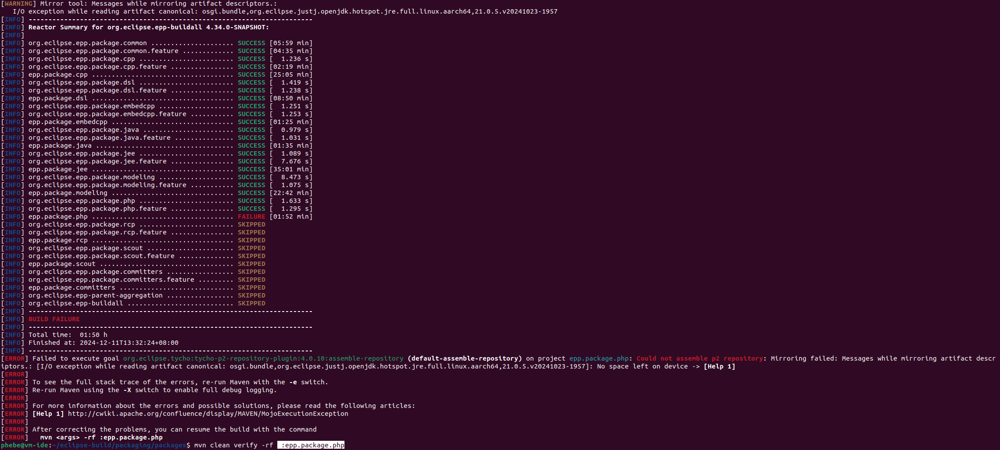

上述问题在于环境存储空间不足，解决问题后再次 `mvn clean verify`   构建顺利。

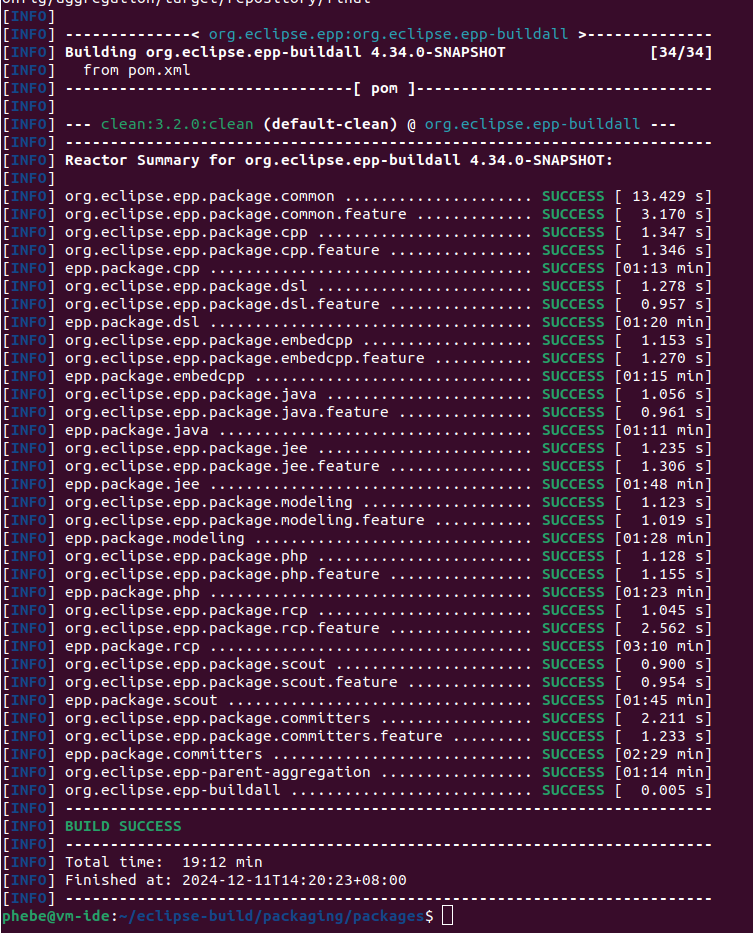

### 构建成果

构建产出路径：不同的工程都有不同的产出路径，规则如下：packages/org.eclipse.epp.package.${PACKAGE}.product/target/products

如 embedcpp 的产出路径为：packages/packages/org.eclipse.epp.package.embedcpp.product/target/products

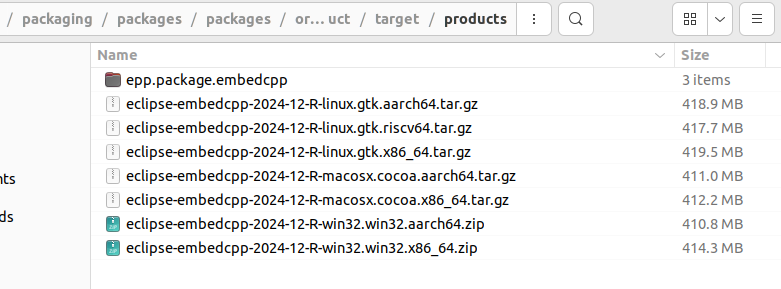

仅仅执行 mvn clean verify 似乎只会在每个org.eclipse.epp.package.${PACKAGE}.product 下生成 target 相关内容，但是 org.eclipse.epp.package.${PACKAGE}.product/target 下并无最终要的 product文件夹：

需要执行：mvn clean verify -Pepp.package.embedcpp -Pepp.materialize-products

clean 会清理之前的构建结果。
verify 会执行构建和测试。
-Pepp.package.embedcpp 是指定要构建的包。
-Pepp.materialize-products 会生成最终的可执行程序包。
构建完成后，您可以在 packages/org.eclipse.epp.package.embedcpp.product/target/products/ 路径找到生成的 .tar.gz 文件

```
#mvn verify -Pepp.p2.common -Pepp.product.cpp -Pepp.p2.cpp -Pepp.materialize-products

#生成 eclipse-embedcpp-2024-09-R-linux-gtk-x86_64.tar.gz 可执行程序
mvn clean verify -Pepp.p2.common -Pepp.package.embedcpp -Pepp.materialize-products
在这个命令中：
clean 会清理之前的构建结果。
verify 会执行构建和测试。
-Pepp.p2.common 是一个通用配置文件。
-Pepp.package.embedcpp 是指定要构建的包。
-Pepp.materialize-products 会生成最终的可执行程序包。
构建完成后，您可以在 packages/org.eclipse.epp.package.embedcpp.product/target/products/ 路径找到生成的 .tar.gz 文件

mvn clean package -Pepp.package.rcp -Pepp.materialize-products
mvn clean package -Pepp.p2.common -Pepp.package.embedcpp -Pepp.materialize-products
```

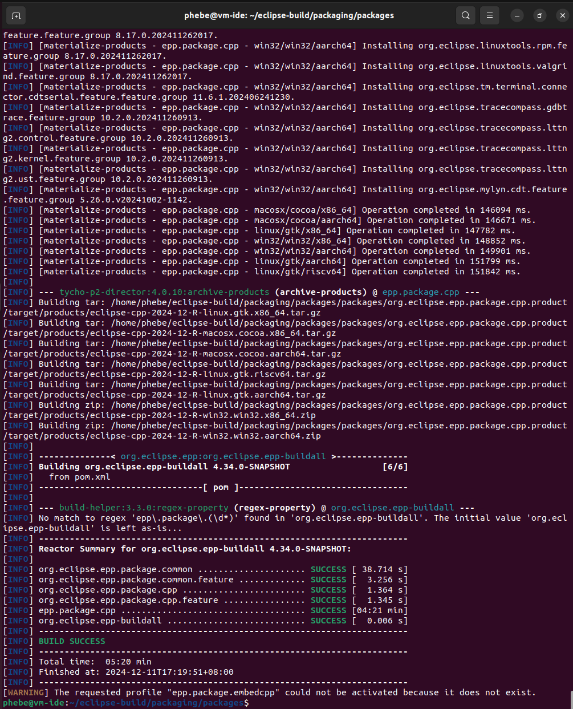

```
mvn clean install -U
mvn clean verify -Pepp.package.embedcpp -Pepp.materialize-products
#mvn clean verify -Pepp.package.embedcpp -Pepp.materialize-products -X
#mvn dependency:resolve
```

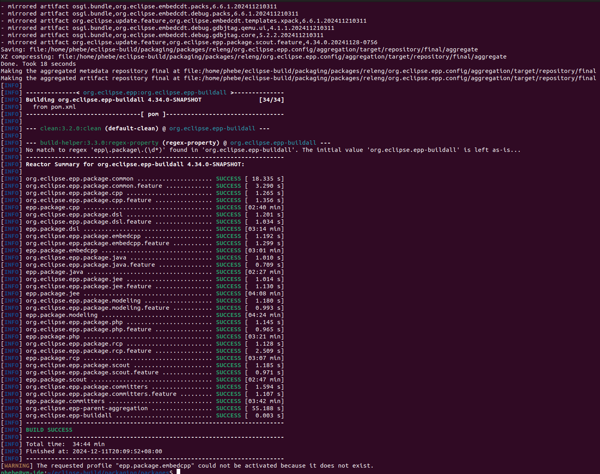

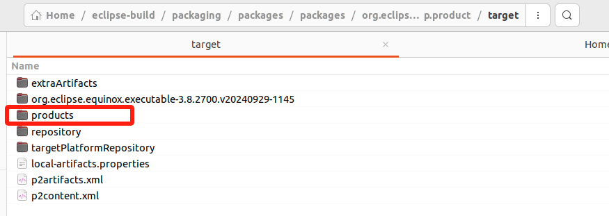

### 产出验证

找到 packages/packages/org.eclipse.epp.package.embedcpp.product/target/products 下的 eclipse-embedcpp-2024-12-R-linux.gtk.x86_64.tar.gz

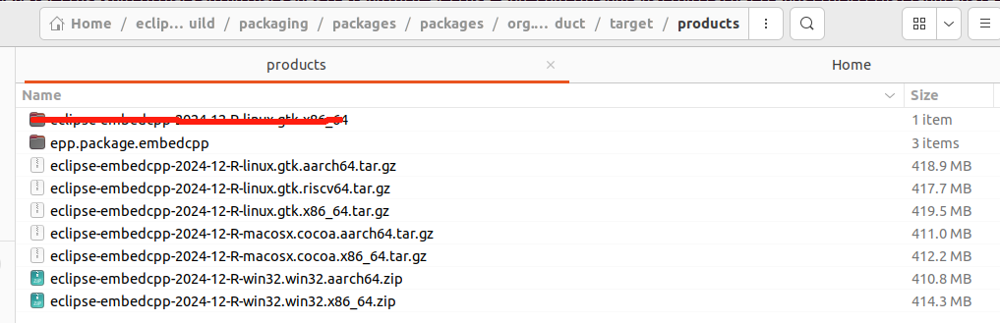

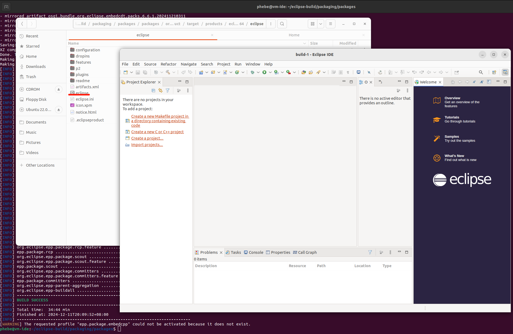

## 总结

- 构建前提：**java 21 +** ；maven 3.9.9 ok (具体需要什么版本以上未确定)

  注意提前安装好上述对应版本的openjdk 和maven，并设置好环境变量。
- 本地构建：

  ```
  # clone代码
  mkdir packaging  && cd packaging
  git clone https://github.com/eclipse-packaging/packages.git
  cd packages

  # 新建一个分支，将代码回退到202412R版本对应
  git checkout -b 202412R 
  git branch
  git reset --hard be56417bc51b8803ddf97748a78201e0421ef2f8

  # 在202412R分支上构建
  mvn clean verify
  #mvn -X clean verify

  # 生成embedcpp包
  mvn clean verify -Pepp.package.embedcpp -Pepp.materialize-products


  -----
  修改配置或者源码后再构建：
  mvn clean verify -Pepp.package.embedcpp -Pepp.materialize-products

  如果出错，可以全部重来一遍：
  mvn clean verify
  mvn clean verify -Pepp.package.embedcpp -Pepp.materialize-products

  ```
- 包路径：packages/packages/org.eclipse.epp.package.embedcpp.product/target/products 下
