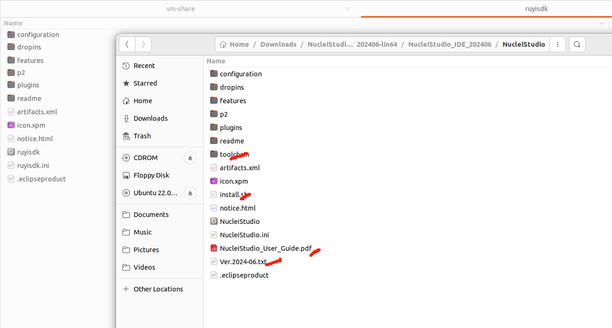

## GUI自定义需求

### 未改造前

1. 压缩包名称：

   

   - NucleiStudio_IDE_202406-lin64.tgz
     - https://download.nucleisys.com/upload/files/nucleistudio/NucleiStudio_IDE_202406-lin64.tgz
   - NucleiStudio_IDE_202406-win64.zip
   - https://download.nucleisys.com/upload/files/doc/nucleistudio/Nuclei_Studio_User_Guide.202406.pdf
   - https://download.nucleisys.com/upload/files/toolchain/gcc/nuclei_riscv_newlibc_prebuilt_linux64_2024.06.tar.bz2
2. 根目录、解压缩后的文件内容（文件命名）

   

   
3. 启动方式

   ./eclipse
4. 启动界面

   

   

   
5. 主界面

   
6. About
   

### 参考竞品

### https://github.com/riscv-mcu

1. 压缩包名称：

   - NucleiStudio_IDE_202406-lin64.tgz
     - https://download.nucleisys.com/upload/files/nucleistudio/NucleiStudio_IDE_202406-lin64.tgz
   - NucleiStudio_IDE_202406-win64.zip
   - https://download.nucleisys.com/upload/files/doc/nucleistudio/Nuclei_Studio_User_Guide.202406.pdf
   - https://download.nucleisys.com/upload/files/toolchain/gcc/nuclei_riscv_newlibc_prebuilt_linux64_2024.06.tar.bz2
2. 根目录、解压缩后的文件内容（文件命名）

   文件夹名：NucleiStudio

   
3. 启动方式
   ./NucleiStudio

   双击
4. 启动界面

   

   
   
5. 主界面
   
   
   
6. About

   
   

### 改造任务清单

* [ ] 压缩包名称
* [ ] 根目录
* [ ] 解压缩后的文件内容（文件命名）
* [ ] 启动命令
* [ ] 启动界面
* [ ] 主界面
* [ ] AboutText
* [ ] 上述过程中的Title提示字：APPName
