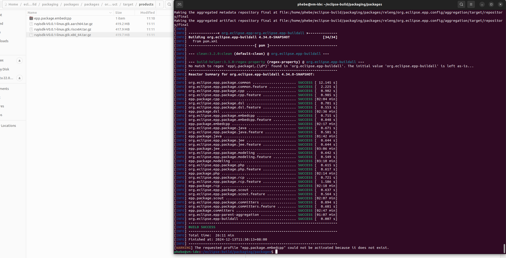

# 自定义GUI，packages修改说明

## 改造目标

参考[GUI改造需求说明](./2-guiRequires.md)

改造内容包括：

* [ ] 压缩包名称
* [ ] 根目录
* [ ] 解压缩后的文件内容（文件命名）
* [ ] 启动命令
* [ ] 启动界面
* [ ] 主界面
* [ ] AboutText
* [ ] 上述过程中的Title提示字：APPName

## 主要配置文件

### packages/icons

* [X] icon.xpm	     256*256px 透明底  ：适用于linux图标，替换
* [X] eclipse.ico    256*256px  透明底 ：添加ruyisdk.ico，还需要在代码中找到对应位置并修改文件名
* [ ] Eclipse.icns   512*512 px  白底  :  .icns是苹果操作系统中用于图标的一种文件格式

### packages/packages/org.eclipse.epp.package.[embedcpp]/

#### 图片

About Eclipse IDE 图标：准备新的相同分辨率的图标替换

```
  eclipse16.png
  eclipse16@2x.png
  eclipse32.png
  eclipse32@2x.png
  eclipse48.png
  eclipse48@2x.png
  eclipse256.png
  eclipse256@2x.png

  eclipse_lg.png
  eclipse_lg@2x.png

  epp32.png
```

#### build.properties

注意图片资源替换，加入到构建路径中:修改了图片名称的，对应要在这个文档中增加或者删除图片

* [X] eclipse16.png
* [X] eclipse16@2x.png
* [X] eclipse32.png
* [X] eclipse32@2x.png
* [X] eclipse48.png
* [X] eclipse48@2x.png
* [X] eclipse256.png
* [X] eclipse256@2x.png
* [ ] eclipse_lg.png			116*302px
* [ ] eclipse_lg@2x.png		232*604px
* [ ] epp32.png

#### plugin.xml

* [X] 10行： product name：启动界面提示字、主界面窗口Title名等各个界面的提示字符都会替换
* [X] 17：appName
* [X] 21 ：aboutText：eclipse —> about 界面显示的内容
* [ ] 37：aboutImage：about页面左侧的背景图片
* [X] 41：windowImages：windows下的图标/图片
* [X] 45：introBrandingImage：欢迎页面图片
* [X] 49：introTitle：欢迎页面的显示字，跟在introBrandingImage之后
* [ ] 53：introBrandingImageText

#### about.ini

> 不确定是否必须修改，似乎没用上

* [X] windowImage=eclipse16.png
* [ ] aboutImage=eclipse_lg.png
* [X] appName=Eclipse

### packages/packages/org.eclipse.epp.package.[embedcpp].product/epp.product

* [ ] 7 ：`<image path="/org.eclipse.epp.package.embedcpp/eclipse_lg.png"/>`
* [X] 45 ：windowImages
* [X] 52 ：launcher name= eclipse ——》ruyisdk
* [X] 53-54 ：Launching：win、macos、linux

### packages/releng/org.eclipse.epp.config/parent/pom.xml

* [ ] 132-168 : environments 定义二进制包构建输出的系统和架构
* [X] 148-167 ：注释屏蔽 win32 + macosx（磁盘空间有限，win 和 macos 可先屏蔽，优先构建linux系统的3个架构）
* [X] 314： rootFolder 打包解压根目录名
* [X] 316：rootFolders macosx
* [X] 319：archiveFileName 打包的压缩包名

  > release archiveFileName： eclipse-{eclipse.epp.id}-{eclipse.simultaneous.release.id}
  >
  > eclipse.epp.id = project.artifactId =? org.eclipse.epp-parent
  > packages/releng/org.eclipse.epp.config/parent/product/pom.xml    Line17-22 : 4.34.0-SNAPSHOT
  >
  > eclipse.simultaneous.release.id = {RELEASE_NAME}-{RELEASE_MILESTONE}    = 2024-12-R
  > RELEASE_NAME = 2024-12
  > RELEASE_MILESTONE = R
  >

### packages/packages/org.eclipse.epp.package.common

- 启动过程中背景图：splash.bmp  452*302px ：替换图片
- build.properties(修改了图片名称的，对应要在这个文档中增加或者删除图片)

## 重新构建

```
mvn clean verify -Pepp.package.embedcpp -Pepp.materialize-products
```


