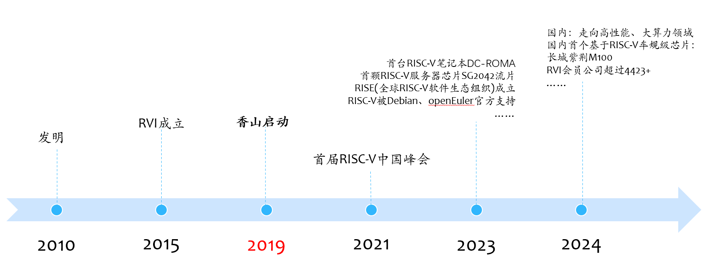
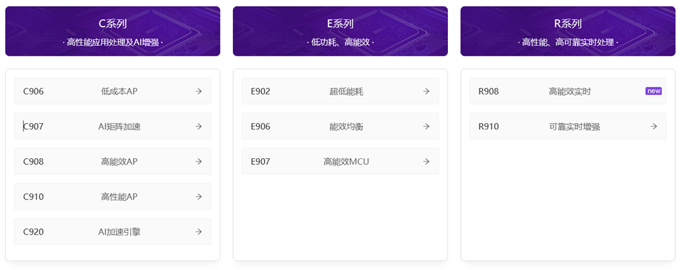

## RISC-V 简介

### RISC-V

不多说，提供一些网页供未接触过的小伙伴们了解，当然你可以自己去搜索了解。

- 维基百科：https://zh.wikipedia.org/wiki/RISC-V
- RISC-V International（RISC-V国际基金会）：https://riscv.org/
- RISC-V 中国峰会：https://riscv-summit-china.com/
  - 2021首届 RISC-V中国峰会在上海举办；
  - 每年举办一次；
- RISC-V国际基金会 B站：https://space.bilibili.com/1121469705
  - 历届峰会演讲视频
- PLCT实验室创始人 B站（lazyparser）：https://space.bilibili.com/296494084
  - 一位励志当上知识区扛把子的RISC-V国际基金会大使
  - PLCT实验室 RISC-V知识区技术分享
- 其它RISC-V知识博主：
  - 谁说现在是冬天呢：https://space.bilibili.com/1829697 （没错IDE中的示例是从这里出来的）
  - 其它自行搜索啦，挺多的~~

### RISC-V 发展历程，及为什么我们要做RISC-V IDE

- 2010年：最早由美国加州大学伯克利分校（简称伯克利）的Krste Asanovic教授、Andrew Waterman和Yunsup Lee等开发人员于2010年发明，并且得到了计算机体系结构领域的泰斗David Patterson的大力支持。
- 2015年：RISC-­V基金会(www.riscv.org) 成立，负责维护标准的RISC-­V指令集手册与架构文档，并负责RISC-­V开源架构的全球推广工作，也组织会员共同推动RISC-­V的标准完善和应用落地。首批加入RVI的成员企业大约13家。
- 2019年：在中国科学院支持下，由中国科学院计算技术研究所 牵头发起
  “香山” 高性能开源 RISC-V 处理器项目。RISC-V在中国得到广泛关注，很多企业加入RISC-V领域。
- 2021年6月：第一届 RISC-V 中国峰会在上海科技大学盛召开，线下超过1000人、线上超过10000人参会，超过100家厂商参与演讲或展览。
- 2023年

  - 首颗RISC-V服务器芯片SG2042流片（22年底流片，23年初正式发布）
  - 3月：首台RISC-V笔记本DC-ROMA上市，RISC-V从嵌入式发展到通用计算领域
  - 6月，全球RISC-V软件生态计划RISE（RISC-V Software Ecosystem）组织成立。该计划由谷歌、英特尔、高通、联发科、Andes、平头哥、Rivos、SiFive、Ventana、三星、英伟达、Imagination等共13家产业巨头共同发起的，旨在协助RISC-V国际基金会共同加速RISC-V商用软件生态建设。它的成立，标志着RISC-V软件生态从纯开源主导、基金会主导进入商业化主导、全球大规模共建的时代。
  - RISC-V架构得到openEuler官方支持
- 2024年

  - 国内趋势：走向高性能、大算力领域
  - 行业落地：国内首个基于RISC-V车规级芯片长城紫荆M100
  - RVI会员公司超过4423+

> 说明：上述的时间线有些不一定非常准确，这里主要是通过大致的时间线让大家了解下RISC-V的发展趋势和进展速度，有个整体上的感知。

说上面这些，主要是想表明，RISC-V从硬件生态上，已经完成了笔记本这种通用计算机生产，而且已经有了服务器级别的芯片和产品，目前国内最前沿的RISC-V芯片厂商已经开始走向高性能、大算力领域。
而软件生态方面，openEuler等以国内主导的开源操作系统目前已经将RISC-V纳入T1级别的支持。

- 官方支持：T1级别的架构是openEuler官方支持的架构，这意味着社区会为这些架构提供最全面和最深入的支持。
- 功能同步：T1级别的架构会与openEuler的最新版本保持功能同步，包括最新的特性和优化。
- 软件包和工具链：对于T1级别的架构，openEuler会提供完整的软件包集合和工具链，以确保用户可以获得与x86或ARM架构相似的体验。
- 质量保证：T1级别的架构会接受openEuler社区的质量保证流程，包括全面的测试和验证，确保软件质量和系统稳定性。
- 问题解决和更新：对于T1级别的架构，openEuler社区会优先解决发现的问题，并定期发布更新和安全补丁。

**Ubuntu、Debian（含PLCT基于Debian的衍生版RevyOS）、Fedora**、Arch Linux、Gentoo、Deepin、openKylin、openAnolis等很多Linux发行版虽然对RISC-V支持程度所有不同，但是对RISC-V有着不错的支持，各操作系统都有发布QEMU或者某些RISC-V设备镜像供大家使用。

操作系统及其软件生态对RISC-V的支持的完善度保证了用户可用的计算机软件生态的丰富程度，意味着可以满足更多人日常使用甚至办公所需。

从RISC-V软件生态的发展来说，除了一些底层研发人员完成RISC-V的适配和优化外，也需要更多的应用开发者加入进来，带动RISC-V软件生态的发展和完善。随着RISC-V硬件性能的提升，面向RISC-V开发的一体化集成开发环境的需求也越发突出，因此这个项目被提出来啦

**因此，本章节不会分享RISC-V的基础知识，因为这个大家有兴趣可以自己搜索了解。更多偏向探讨和介绍如何让ruyisdk能够更好的支持开发者进行开发。**

### RISC-V 硬件厂商

在硬件领域，我们常听到的一些名词有：芯片IP、CPU处理器、SOC、开发板或计算机。芯片IP一般是上游产业，然后依次是CPU处理器、SOC、开发板或计算机研发厂商。

我不太懂硬件领域的事情，主要从研发能力的角度简单分享下当前国内关注度比较高的一些厂商及其产品，主要是让大家有个了解，这个跟ruyisdk项目的工作目标和内容关联。

| 芯片IP                     | CPU处理器             | SOC                     | 开发板或计算机设备               |
| -------------------------- | --------------------- | ----------------------- | -------------------------------- |
| [香山](https://xiangshan.cc/) | 雁西湖、南湖、昆明湖  |                         |                                  |
|                            | 香山南湖微架构        |                         | 香山南湖笔记本电脑“如意香山本” |
| [玄铁](https://www.xrvm.cn/)  | 玄铁9系列 C系 E系 R系 |                         |                                  |
| 玄铁E902                   | 无剑100芯片           |                         |                                  |
| 玄铁（未公开芯片型号）     | 无剑600芯片           |                         |                                  |
| 玄铁C910                   |                       | 玄铁-曳影1520（TH1520） |                                  |
|                            |                       | 曳影1520（TH1520）      | LicheePi 4A                      |
|                            |                       | 曳影1520（TH1520）      | Milk-V Meles                     |
|                            |                       | 曳影1520（TH1520）      | BeagleV-Ahead                    |
| (未公开，但有说是玄铁C910) |                       | 算能科技-算丰SG2042     |                                  |
|                            |                       | 算丰SG2042              | Milk-V pioneer                   |
|                            |                       |                         |                                  |

> 这里数据仅列举了几个示意下，后面有时间我慢慢补吧。有兴趣的可以关注相关企业：香山、阿里巴巴玄铁、算能科技、进迭时空、奕斯伟、芯来科技、嘉楠科技、赛昉科技、晶心科技、全志、矽速科技、群芯闪耀(Milk-V) 等厂商了解。国外的还有 SiFive 等；

### RuyiSDK RISC-V开发板支持计划

- Milk-V Duo/Duo 256M/DuoS：很多业内小伙伴都通过使用体验分享免费领到了Milk-V Duo 吧，可能是目前个人持有量比较高的设备之一了。
- Milk-V Meles（TH1520）
- LicheePi 4A（TH1520）
